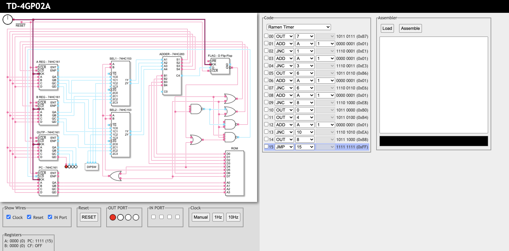

#### 简介
本人主要从事Java Web开发，因公司项目需要，需要使用Go语言。之前学习Java语言，在学习基础语法之后，通过字节码了解内部实现。学习Go时，也想了解内部实现，在看到嘀嘀大神讲解[Go Plan9汇编入门](https://www.youtube.com/watch?v=dPdXxex1v_4)及[PPT讲义](https://github.com/cch123/asmshare/blob/master/layout.md)之后，感觉很有趣，就购买了《汇编语言:基于x86处理器》(第九版)，使用vs2015学习汇编基础知识。  
在学习的过程中，对CPU的工作原理及实现很感兴趣，就像学习一些CPU及数字电路的基本知识。正好在网上看到[自制4位cpu入门视频](https://hackaday.io/project/26215-td4-cpu)，决定以此为契机，接触并学习数字电路的基础知识，通过此过程对CPU工作原理及汇编知识有进一步的认知,为更加深入的学习GO做铺垫! :muscle:   

### [TD4-CPU基础知识(摘抄)](origin.readme.md)
### [TD4-CPU自己动手制作](self.readme.md)

* ### [数字电路基本知识](./base-knowledge.md)
* ### [单片机原理及应用](./mcu-knowledge.md)
* ### [数字电路及单片机实验](./md/mcu-learn/README.md)  
* ### [TD4-CPU仿真](./td4-simulate.md)
* ### [GO汇编指令学习](./go-asm.md) 
* ### [go语言课程学习札记](https://github.com/ymm135/go-coding)

### [TD4-CPU 原理在线模拟](https://vanya.jp.net/td4/)  

</img>
  
模块设计图  
</img>
  
原理图  
</img>
  

-----
原作者的README: 

</img>  

#### [自己动手做CPU 之 TD4 前言](https://www.bilibili.com/video/av19607028/) ####
#### [自己动手做CPU 之 TD4 原理分析0-系统综述](https://www.bilibili.com/video/av19608406/) ####
#### [自己动手做CPU 之 TD4 原理分析1-[时钟、复位]](https://www.bilibili.com/video/av19609356/) ####
#### [自己动手做CPU 之 TD4 原理分析2-[存储器、输入、输出]](https://www.bilibili.com/video/av19637295/) ####
#### [自己动手做CPU 之 TD4 原理分析3-[控制器、运算器]](https://www.bilibili.com/video/av19640430/) ####
\#LOAD0 = D6 | D7  
\#LOAD1 = #D6 | D7  
\#LOAD2 = #(#D6 & D7)  
\#LOAD3 = #(D6 & D7 & (#C | D4))  
SEL_A   = D4 | D7  
SEL_B   = D5

#### [自己动手做CPU 之 TD4 PCB及元器件](https://www.bilibili.com/video/av20360412/) ####
#### [自己动手做CPU 之 TD4 焊接测试0-说明](https://www.bilibili.com/video/av20396047/) ####
A.  先焊接尺寸小，低的元器件，再焊接高的元器件，推荐焊接顺序如下:  
    1. 发光LED，二极管1N4148，直插电阻，USB接口。  
    2. IC插座  
    3. 8位拨码开关、4位拨码开关  
    4. 按键开关，电解电容，拨动开关  

B.  注意芯片插座，8位拨码开关和4位拨码开关的焊接方向  
#### [自己动手做CPU 之 TD4 焊接测试1-[焊接]](https://www.bilibili.com/video/av20396487/) ####
#### [自己动手做CPU 之 TD4 焊接测试2-[测试]](https://www.bilibili.com/video/av20400512/) ####

#### [自己动手做CPU 之 TD4 后记](https://www.bilibili.com/video/av20401635/) ####
架构  
1. RAM  
2. 4bit -> 8bit  
3. ALU  
4. 中断  

指令  
1. 算术逻辑指令  
2. 寻址方式（立即数寻址、相对寻址、寄存器寻址等）  
3. call push pop  

reference0:  
[指令格式](https://github.com/wuxx/TD4-4BIT-CPU/blob/master/doc/instruction.md)  
[TD4套件](https://item.taobao.com/item.htm?spm=a1z10.1-c-s.w4004-21291591846.20.3ee420f8z442NM&id=586081308296)

reference1:  
https://hackaday.io/project/8442-ttl-based-4-bit-cpu  
https://hackaday.io/project/26215-td4-cpu  
http://kamakurium.com/wp-content/uploads/2016/01/cpu_td4  
http://visual6502.org/  
http://www.4004.com/  
