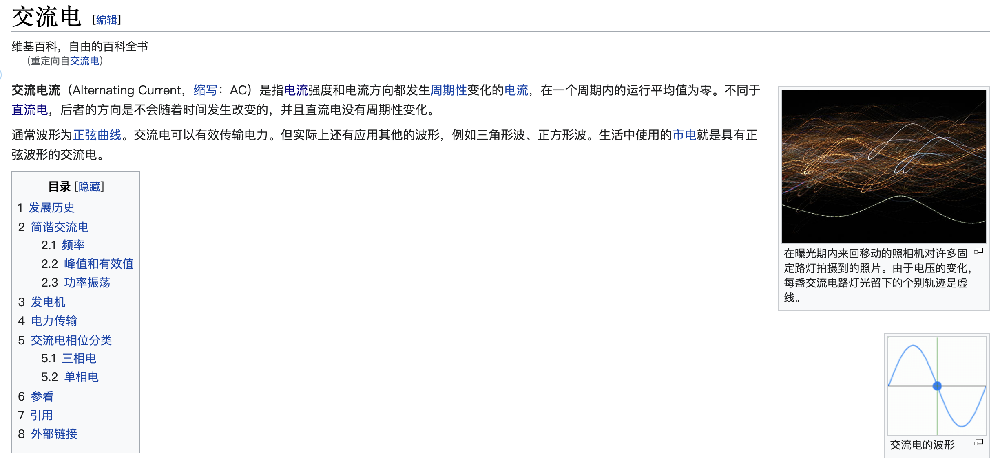

### 电子元器件与电路基础
### 电路基础
##### 电流电压欧姆定律
  
  
  
  
  

##### 通路、短路(开路)、短路
通路：电路有电流流过负载  
断路：电路中没有电流  
短路：电路中没有负载  
  
##### 基尔霍夫电路定律
  

##### 直流电与交流电
  

### 电子元器件
### proteus仿真使用
[英文手册](https://labcenter.s3.amazonaws.com/downloads/Tutorials.pdf)  

##### LED流水灯实验(入门)
实验目的([摘自爱课程大学单片机原理课程](https://www.icourses.cn/web/sword/portal/shareDetails?&&cId=5981#/course/chapter))  
  
  

