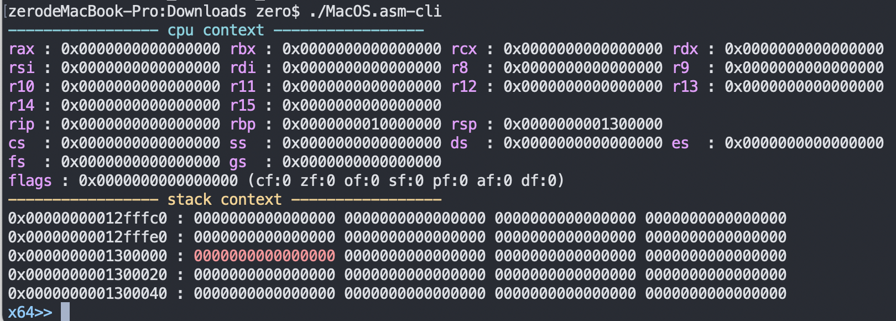
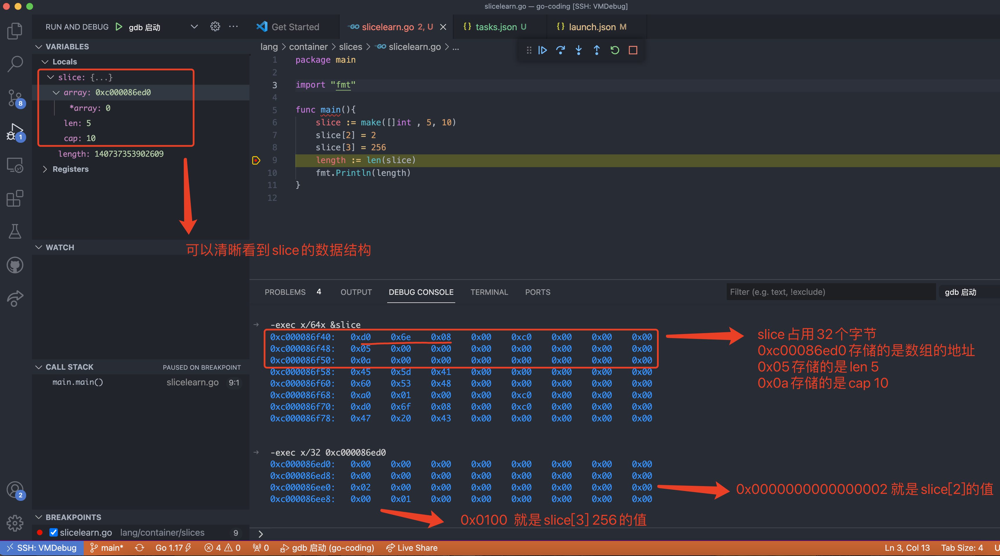
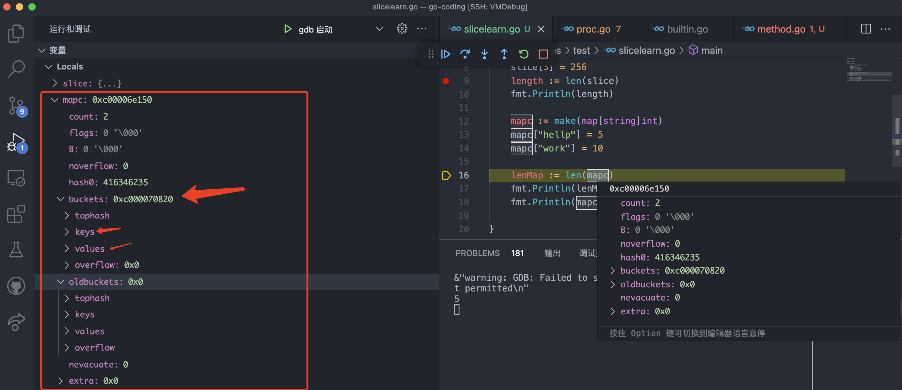
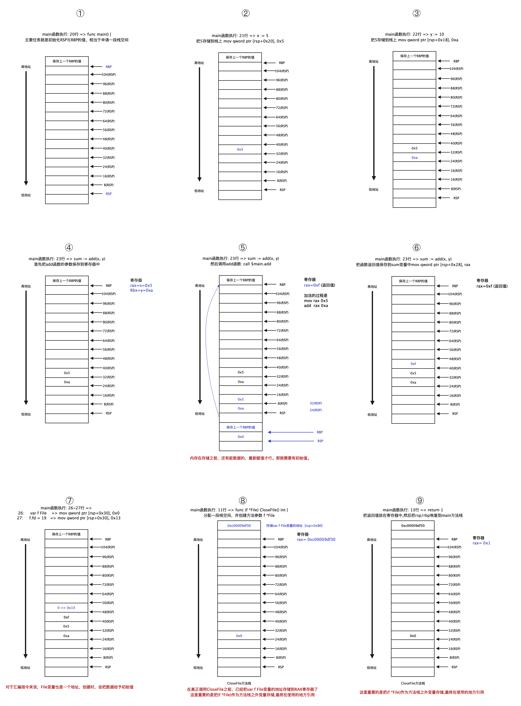

- [Go 汇编指令学习](#go-汇编指令学习)
    - [汇编指令学习](#汇编指令学习)
    - [x86/AT&T/Plan9 汇编](#x86attplan9-汇编)
      - [x86汇编指令](#x86汇编指令)
      - [plan9汇编指令](#plan9汇编指令)
    - [Go汇编指令学习](#go汇编指令学习)
      - [Go Slice汇编指令学习](#go-slice汇编指令学习)
      - [Go map结构](#go-map结构)
      - [Go 函数调用和方法调用](#go-函数调用和方法调用)
      - [Go 结构体和接口实现](#go-结构体和接口实现)

## Go 汇编指令学习
#### 汇编指令学习
如果想单纯学习汇编指令，我使用的书籍是《汇编语言:基于x86处理器(原书第7版)》,汇编IDE使用vs2015+MASM。  

> 关于MASM:  
> Visual Studio包括面向 x64 代码的 Microsoft Assembler (MASM) 32 位和 64 位托管版本。 命名为 ml64.exe，这是接受 x64 汇编程序语言的汇编程序。 在安装过程中选择 C++ 工作负载时，将安装 MASM Visual Studio工具。 MASM 工具不单独下载。 有关如何下载和安装副本的说明，Visual Studio安装 Visual Studio。 如果不想在 IDE 中安装完整的 Visual Studio，但只想安装命令行工具，请下载适用于Visual Studio。

[MASM基本使用](https://github.com/ymm135/Irvine)


本书籍的[官方网站](http://www.asmirvine.com/index6th.htm).  [源码仓库](https://github.com/ymm135/Irvine). [vs2015工程](../TD4-4BIT-CPU/res/files/汇编语言vs2015工程)  

网络公开课[汇编语言程序设计](https://www.icourses.cn/web/sword/portal/shareDetails?cId=2720#/course/chapter)
[ppt讲义](./doc/汇编程序设计)


可以通过其他工具查看寄存器及调用栈 [asm-cli](https://github.com/cch123/asm-cli)  

  

#### x86/AT&T/Plan9 汇编
##### x86汇编指令  
[x86汇编官方文档介绍](https://software.intel.com/content/www/us/en/develop/articles/introduction-to-x64-assembly.html)  

多年来，PC程序员使用 x86 汇编来编写性能关键代码。但是，32 位 PC 正在被 64 位 PC 取代，并且底层汇编代码已更改。本白皮书是对 x64 汇编的介绍。不需要 x86 代码的先验知识，尽管它使转换更容易。

**x64 是对 Intel 和 AMD 32 位 x86 指令集架构 (ISA) 的 64 位扩展的通用名称。** AMD 推出了 x64 的第一个版本，最初称为 x86-64，后来更名为 AMD64。英特尔将他们的实现命名为 IA-32e，然后是 EMT64。两个版本之间存在一些轻微的不兼容，但大多数代码在两个版本上都可以正常工作；详细信息可以在英特尔® 64 和 IA-32 架构软件开发人员手册中找到和 AMD64 架构技术文档。我们称这种交叉风格为 x64。两者都不要与 64 位英特尔® 安腾® 架构（称为 IA-64）混淆。

本白皮书不会涵盖硬件细节，例如缓存、分支预测和其他高级主题。文章末尾将提供一些参考资料，以便在这些领域进一步阅读。

汇编通常用于程序的性能关键部分，尽管对于大多数程序员来说，它的性能很难超过一个好的 C++ 编译器。汇编知识对于调试代码很有用——**有时编译器会生成不正确的汇编代码，在调试器中单步调试代码有助于找到原因。代码优化器有时会出错。汇编的另一个用途是连接或修复没有源代码的代码。反汇编可让您更改/修复现有的可执行文件。如果您想知道您选择的语言在底层是如何工作的——为什么有些事情很慢而有些事情很快，那么汇编是必要的。最后，在诊断恶意软件时，汇编代码知识是必不可少的。**
  
通用架构
由于 64 位寄存器允许访问多种大小和位置，我们定义一个字节为 8 位，一个字为 16 位，双字为 32 位，四字为 64 位，双四字为 128 位. Intel 将字节存储为“little endian”，这意味着较低的有效字节存储在较低的内存地址中。  
x86通用架构  


  


汇编器工具: Assemblers  
An Internet search reveals x64-capable assemblers such as the Netwide Assembler [NASM](https://www.nasm.us/), a NASM rewrite called [YASM](http://yasm.tortall.net/), the fast Flat Assembler [FASM](http://flatassembler.net/), and the traditional Microsoft MASM. There is even a free IDE for x86 and x64 assembly called WinASM. Each assembler has varying support for other assemblers' macros and syntax, but assembly code is not source-compatible across assemblers like C++ or Java* are.

For the examples below, I use the 64-bit version of MASM, ML64.EXE, freely available in the platform SDK. For the examples below note that MASM syntax is of the form Instruction Destination, Source

Some assemblers reverse source and destination, so read your documentation carefully.

##### plan9汇编指令 
现在是有plan9操作系统,但是也有一套plan9的汇编指令。  


因为plan9是抽象的汇编指令，最终还要转换为对应CPU的汇编指令，如果在debug时，能够反汇编，并且知道对应关系，那就可以直接查看反汇编指令。(最重要的是x86汇编可以调试,便于理解).  

但是现在gdb调试go语言不是最好的，最佳的攻击是: [delve](https://github.com/go-delve/delve) deleve的[指令详解](https://github.com/go-delve/delve/tree/master/Documentation/cli)  参考文档:[go语言调试](https://golang.org/doc/gdb) 

#### Go汇编指令学习
##### Go Slice汇编指令学习
- **go中slice的具体实现**

src/runtime/slice.go
```
type slice struct {
	array unsafe.Pointer
	len   int
	cap   int
}
```

slice 共有三个属性： 指针，指向底层数组； 长度，表示切片可用元素的个数，也就是说使用下标对 slice 的元素进行访问时，下标不能超过 slice 的长度； 容量，底层数组的元素个数，容量 >= 长度。在底层数组不进行扩容的情况下，容量也是 slice 可以扩张的最大限度。  

- slice的创建

```
直接声明     var slice[]int
new         slice := *new([]int)
字面量       slice := []int{1,2,3,4,5}
make        slice := make([]int, 5, 10)
从切片或数据截取     slice := array[1:5] 或 slice := sourceSlice[1:5]
```
  


- 源代码  

```
> main.main() ./slicelearn.go:5 (hits goroutine(1):1 total:1) (PC: 0x10aba2f)
     1:	package main
     2:	
     3:	import "fmt"
     4:	
=>   5:	func main(){
     6:		slice := make([]int , 5, 10)
     7:		slice[2] = 2
     8:		slice[3] = 256
     9:		length := len(slice)
    10:		fmt.Println(length)
```

**使用delve调试界面**  
delve功能非常强大，基本操作有增删断点，全局局部变量打印，断点调试等，另外还反汇编代码查看、汇编断点调试、内存查看等
vscode使用的是DAP(debug adapter). 也可以使用[gdlv](https://github.com/aarzilli/gdlv)独立的IDE,macos需要安装dlv.(brew install delve)

编译问题:  
```
vendor/github.com/go-gl/glfw/v3.3/glfw/c_glfw.go

  1 package glfw
  2 
  3 /*
  4 #include "glfw/src/context.c"
  5 #include "glfw/src/init.c"
  6 #include "glfw/src/input.c"
  7 #include "glfw/src/monitor.c"
  8 #include "glfw/src/vulkan.c"
  9 #include "glfw/src/window.c"
 10 #include "glfw/src/osmesa_context.c"
 11 */
 12 import "C"
```

找不到c文件??  
把glfw的源码放在了/usr/local/include文件夹下。  


[Delve调试器](https://chai2010.cn/advanced-go-programming-book/ch3-asm/ch3-09-debug.html)

![[./res/vscode-go-debug-dap.png]]  

```
# 开始调试
dlv debug

# 设置断点
b slicelearn.go:5

# 开始调试
continue

# 下一个语句
next

# 跳入
s

# 在调试汇编时，可以执行si，进行单个汇编指令调试，对于分析非常好用
si

(dlv) help
The following commands are available:
    args ------------------------ Print function arguments.
    break (alias: b) ------------ Sets a breakpoint.
    breakpoints (alias: bp) ----- Print out info for active breakpoints.
    clear ----------------------- Deletes breakpoint.
    clearall -------------------- Deletes multiple breakpoints.
    condition (alias: cond) ----- Set breakpoint condition.
    config ---------------------- Changes configuration parameters.
    continue (alias: c) --------- Run until breakpoint or program termination.
    disassemble (alias: disass) - Disassembler.(反汇编)
    down ------------------------ Move the current frame down.
    exit (alias: quit | q) ------ Exit the debugger.
    frame ----------------------- Set the current frame, or execute command...
    funcs ----------------------- Print list of functions.
    goroutine ------------------- Shows or changes current goroutine
    goroutines ------------------ List program goroutines.
    help (alias: h) ------------- Prints the help message.
    list (alias: ls | l) -------- Show source code.
    locals ---------------------- Print local variables.
    next (alias: n) ------------- Step over to next source line.
    on -------------------------- Executes a command when a breakpoint is hit.
    print (alias: p) ------------ Evaluate an expression.
    regs ------------------------ Print contents of CPU registers.
    restart (alias: r) ---------- Restart process.
    set ------------------------- Changes the value of a variable.
    source ---------------------- Executes a file containing a list of delve...
    sources --------------------- Print list of source files.
    stack (alias: bt) ----------- Print stack trace.
    step (alias: s) ------------- Single step through program.
    step-instruction (alias: si)  Single step a single cpu instruction.
    stepout --------------------- Step out of the current function.
    thread (alias: tr) ---------- Switch to the specified thread.
    threads --------------------- Print out info for every traced thread.
    trace (alias: t) ------------ Set tracepoint.
    types ----------------------- Print list of types
    up -------------------------- Move the current frame up.
    vars ------------------------ Print package variables.
    whatis ---------------------- Prints type of an expression.
Type help followed by a command for full documentation.

寄存器查看
(dlv) regs
    Rip = 0x0000000000494766
    Rsp = 0x000000c000091eb0
    Rax = 0x0000000000494740
    Rbx = 0x0000000000000000
    Rcx = 0x0000000000000000
    Rdx = 0x00000000004b2ae0
    Rsi = 0x0000000000000000
    Rdi = 0x00000000ffffffff
    Rbp = 0x000000c000091f70
     R8 = 0x0000000000000010
     R9 = 0x0000000000000008
    R10 = 0x0000000000000002
    R11 = 0x0000000000000000
    R12 = 0x000000c000091f30
    R13 = 0x0000000000000000
    R14 = 0x000000c0000001a0
    R15 = 0x0000000000000058
 Rflags = 0x0000000000000202	[IF IOPL=0]
     Es = 0x0000000000000000
     Cs = 0x0000000000000033
     Ss = 0x000000000000002b
     Ds = 0x0000000000000000
     Fs = 0x0000000000000063
     Gs = 0x0000000000000000
Fs_base = 0x0000000000530870
Gs_base = 0x0000000000000000

查看内存视图
(dlv) print &slice
(*[]int)(0xc000091f40)

(dlv) x -fmt hex -count 24 -size 1 0xc000091f40
0xc000091f40:   0xd0   0x1e   0x09   0x00   0xc0   0x00   0x00   0x00   
0xc000091f48:   0x05   0x00   0x00   0x00   0x00   0x00   0x00   0x00   
0xc000091f50:   0x0a   0x00   0x00   0x00   0x00   0x00   0x00   0x00

```


**使用gdb调试界面**  
类似于C语言的调试，可以清晰看到slice的内部实现(数据结构),并且可以查看slice的内存视图  


使用gdb查看反汇编
```
-exec help disassemble
Disassemble a specified section of memory.
Default is the function surrounding the pc of the selected frame.
With a /m modifier, source lines are included (if available).
With a /r modifier, raw instructions in hex are included.
With a single argument, the function surrounding that address is dumped.
Two arguments (separated by a comma) are taken as a range of memory to dump,
  in the form of "start,end", or "start,+length".

Note that the address is interpreted as an expression, not as a location
like in the "break" command.
So, for example, if you want to disassemble function bar in file foo.c
you must type "disassemble 'foo.c'::bar" and not "disassemble foo.c:bar".

查看main函数的反汇编代码
-exec disassemble /m main
Dump of assembler code for function main.main:
   0x000000000047e260 <+0>:	lea    -0x48(%rsp),%r12
   0x000000000047e265 <+5>:	cmp    0x10(%r14),%r12
   0x000000000047e269 <+9>:	jbe    0x47e3a2 <main.main+322>
   0x000000000047e26f <+15>:	sub    $0xc8,%rsp
   0x000000000047e276 <+22>:	mov    %rbp,0xc0(%rsp)
   0x000000000047e27e <+30>:	lea    0xc0(%rsp),%rbp
   0x000000000047e286 <+38>:	lea    0x20(%rsp),%rdi
   0x000000000047e28b <+43>:	lea    -0x30(%rdi),%rdi
   0x000000000047e28f <+47>:	nopw   0x0(%rax,%rax,1)
   0x000000000047e298 <+56>:	nopl   0x0(%rax,%rax,1)
   0x000000000047e2a0 <+64>:	mov    %rbp,-0x10(%rsp)
   0x000000000047e2a5 <+69>:	lea    -0x10(%rsp),%rbp
   0x000000000047e2aa <+74>:	callq  0x45b290 <runtime.duffzero+336>
   0x000000000047e2af <+79>:	mov    0x0(%rbp),%rbp
   0x000000000047e2b3 <+83>:	lea    0x20(%rsp),%rcx
   0x000000000047e2b8 <+88>:	test   %al,(%rcx)
   0x000000000047e2ba <+90>:	jmp    0x47e2bc <main.main+92>
   0x000000000047e2bc <+92>:	jmp    0x47e2be <main.main+94>
   0x000000000047e2be <+94>:	mov    %rcx,0x90(%rsp)
   0x000000000047e2c6 <+102>:	movq   $0x5,0x98(%rsp)
   0x000000000047e2d2 <+114>:	movq   $0xa,0xa0(%rsp)
   0x000000000047e2de <+126>:	xchg   %ax,%ax
   0x000000000047e2e0 <+128>:	jmp    0x47e2e2 <main.main+130>
   0x000000000047e2e2 <+130>:	movq   $0x2,0x30(%rsp)
   0x000000000047e2eb <+139>:	mov    0x90(%rsp),%rcx
   0x000000000047e2f3 <+147>:	jmp    0x47e2f5 <main.main+149>
   0x000000000047e2f5 <+149>:	movq   $0x100,0x18(%rcx)
=> 0x000000000047e2fd <+157>:	mov    0x98(%rsp),%rcx
   0x000000000047e305 <+165>:	mov    %rcx,0x18(%rsp)
   0x000000000047e30a <+170>:	movups %xmm15,0x80(%rsp)
   0x000000000047e313 <+179>:	lea    0x80(%rsp),%rcx
   0x000000000047e31b <+187>:	mov    %rcx,0x78(%rsp)
   0x000000000047e320 <+192>:	mov    0x18(%rsp),%rax
   0x000000000047e325 <+197>:	callq  0x4095a0 <runtime.convT64>
   0x000000000047e32a <+202>:	mov    %rax,0x70(%rsp)
   0x000000000047e32f <+207>:	mov    0x78(%rsp),%rcx
   0x000000000047e334 <+212>:	test   %al,(%rcx)
   0x000000000047e336 <+214>:	lea    0x7563(%rip),%rdx        # 0x4858a0
   0x000000000047e33d <+221>:	mov    %rdx,(%rcx)
   0x000000000047e340 <+224>:	lea    0x8(%rcx),%rdi
   0x000000000047e344 <+228>:	cmpl   $0x0,0xd5c35(%rip)        # 0x553f80 <runtime.writeBarrier>
   0x000000000047e34b <+235>:	je     0x47e34f <main.main+239>
   0x000000000047e34d <+237>:	jmp    0x47e355 <main.main+245>
   0x000000000047e34f <+239>:	mov    %rax,0x8(%rcx)
   0x000000000047e353 <+243>:	jmp    0x47e35c <main.main+252>
   0x000000000047e355 <+245>:	callq  0x45ab40 <runtime.gcWriteBarrier>
   0x000000000047e35a <+250>:	jmp    0x47e35c <main.main+252>
   0x000000000047e35c <+252>:	mov    0x78(%rsp),%rax
   0x000000000047e361 <+257>:	test   %al,(%rax)
   0x000000000047e363 <+259>:	jmp    0x47e365 <main.main+261>
   0x000000000047e365 <+261>:	mov    %rax,0xa8(%rsp)
   0x000000000047e36d <+269>:	movq   $0x1,0xb0(%rsp)
   0x000000000047e379 <+281>:	movq   $0x1,0xb8(%rsp)
   0x000000000047e385 <+293>:	mov    $0x1,�x
   0x000000000047e38a <+298>:	mov    %rbx,%rcx
   0x000000000047e38d <+301>:	callq  0x478f80 <fmt.Println>
   0x000000000047e392 <+306>:	mov    0xc0(%rsp),%rbp
   0x000000000047e39a <+314>:	add    $0xc8,%rsp
   0x000000000047e3a1 <+321>:	retq   
   0x000000000047e3a2 <+322>:	callq  0x458b80 <runtime.morestack_noctxt>
   0x000000000047e3a7 <+327>:	jmpq   0x47e260 <main.main>
End of assembler dump.
```

- **汇编指令**  
  
以下这两条指令得到反汇编指令: 
objdump -d slicelearn > att.asm  
go tool objdump -S slicelearn > plan9.asm  

查看汇编指令: 
go tool compile -N -l -S slicelearn.go

使用delve调试，disass查看反汇编

```
    sl.go:5		0x10aba20	  lea r12, ptr [rsp-0x48]          //lea 返回间接操作符的地址,
	sl.go:5		0x10aba25	  cmp r12, qword ptr [r14+0x10]    //cmp 比较, r11,r12临时数据存放
	sl.go:5		0x10aba29	  jbe 0x10abb62                    //JBE/JNA     小于或等于转移
	sl.go:5		0x10aba2f*	  sub rsp, 0xc8                    //c8=200字节, 也就是偏移200/8=25
	sl.go:5		0x10aba36	  mov qword ptr [rsp+0xc0], rbp    //[]是取操作数, 把rbp的内容保存到rsp+0xc0,保留上一次rbp的地址
	sl.go:5		0x10aba3e	  lea rbp, ptr [rsp+0xc0]          //把[rsp+0xc0]地址赋给rbp
=>	sl.go:6		0x10aba46	  lea rdi, ptr [rsp+0x20]          //把rsp+0xc0后的地址赋给rdi
	sl.go:6		0x10aba4b	  lea rdi, ptr [rdi-0x30]          //最终rdi指向rsp的的下16个字节(0x10)
	sl.go:6		0x10aba4f	  nop word ptr [rax+rax*1], ax     //NOP空操作. ax是eax地址的一般
	sl.go:6		0x10aba58	  nop dword ptr [rax+rax*1], eax
	sl.go:6		0x10aba60	  mov qword ptr [rsp-0x10], rbp    //rsp-0x10位置存储rbp的值
	sl.go:6		0x10aba65	  lea rbp, ptr [rsp-0x10]          //把rbp存储rsp-0x10的地址
	sl.go:6		0x10aba6a	  call 0x1060170                   //调用0x1060170函数,可以使用si进行单个cpu指令调试,在调用处设置断点 b duff_amd64.s:95
	sl.go:6		0x10aba6f	  mov rbp, qword ptr [rbp]         
	sl.go:6		0x10aba73	  lea rcx, ptr [rsp+0x20]         //把rsp+0x20内存存放的值赋给rcx rcx=*(rsp+0x20),这个就是slice数组地址
	sl.go:6		0x10aba78	  test byte ptr [rcx], al         //test进行and操作,选择跳转
	sl.go:6		0x10aba7a	  jmp 0x10aba7c
	sl.go:6		0x10aba7c	  jmp 0x10aba7e
	sl.go:6		0x10aba7e	  mov qword ptr [rsp+0x90], rcx   // 往slice的array填充地址(0xc00011fed0)
	sl.go:6		0x10aba86	  mov qword ptr [rsp+0x98], 0x5   // slice的len值5
	sl.go:6		0x10aba92	  mov qword ptr [rsp+0xa0], 0xa   // slice的cap值10
	sl.go:6		0x10aba9e	  data16 nop
	sl.go:7		0x10abaa0	  jmp 0x10abaa2                  //slice[2] = 2
	sl.go:7		0x10abaa2	  mov qword ptr [rsp+0x30], 0x2  //RSP指向的地址是c00011feb0, rsp+0x30=c00011fee0 = 0xc00011fed0+0x10
	sl.go:8		0x10abaab	  mov rcx, qword ptr [rsp+0x90]  // slice[2] = 256
	sl.go:8		0x10abab3	  jmp 0x10abab5
	sl.go:8		0x10abab5	  mov qword ptr [rcx+0x18], 0x100
	sl.go:9		0x10ababd	  mov rcx, qword ptr [rsp+0x98]  //length := len(slice)
	sl.go:9		0x10abac5	  mov qword ptr [rsp+0x18], rcx
	sl.go:10	0x10abaca	  movups xmmword ptr [rsp+0x80], xmm15  //fmt.Println(length)
	sl.go:10	0x10abad3	  lea rcx, ptr [rsp+0x80]
	sl.go:10	0x10abadb	  mov qword ptr [rsp+0x78], rcx
	sl.go:10	0x10abae0	  mov rax, qword ptr [rsp+0x18]
	sl.go:10	0x10abae5	  call $runtime.convT64
	sl.go:10	0x10abaea	  mov qword ptr [rsp+0x70], rax
	sl.go:10	0x10abaef	  mov rcx, qword ptr [rsp+0x78]
	sl.go:10	0x10abaf4	  test byte ptr [rcx], al
	sl.go:10	0x10abaf6	  lea rdx, ptr [rip+0x7443]
	sl.go:10	0x10abafd	  mov qword ptr [rcx], rdx
	sl.go:10	0x10abb00	  lea rdi, ptr [rcx+0x8]
	sl.go:10	0x10abb04	  cmp dword ptr [runtime.writeBarrier], 0x0
	sl.go:10	0x10abb0b	  jz 0x10abb0f
	sl.go:10	0x10abb0d	  jmp 0x10abb15
	sl.go:10	0x10abb0f	  mov qword ptr [rcx+0x8], rax
	sl.go:10	0x10abb13	  jmp 0x10abb1c
	sl.go:10	0x10abb15	  call $runtime.gcWriteBarrier
	sl.go:10	0x10abb1a	  jmp 0x10abb1c
	sl.go:10	0x10abb1c	  mov rax, qword ptr [rsp+0x78]
	sl.go:10	0x10abb21	  test byte ptr [rax], al
	sl.go:10	0x10abb23	  jmp 0x10abb25
	sl.go:10	0x10abb25	  mov qword ptr [rsp+0xa8], rax
	sl.go:10	0x10abb2d	  mov qword ptr [rsp+0xb0], 0x1
	sl.go:10	0x10abb39	  mov qword ptr [rsp+0xb8], 0x1
	sl.go:10	0x10abb45	  mov ebx, 0x1
	sl.go:10	0x10abb4a	  mov rcx, rbx
	sl.go:10	0x10abb4d	  call $fmt.Println
	sl.go:11	0x10abb52	  mov rbp, qword ptr [rsp+0xc0]
	sl.go:11	0x10abb5a	  add rsp, 0xc8
	sl.go:11	0x10abb61	  ret
	sl.go:5		0x10abb62	  call $runtime.morestack_noctxt
	.:0			0x10abb67	  jmp $main.main
```

```
汇编调用的实现: call 0x1060170 src/runtime/duff_amd64.s
Code generated by mkduff.go
runtime·duffzero is a Duff's device for zeroing memory.  主要用于内存清零初始化!
XMM, registers of x86 microprocessors with Streaming SIMD Extensions
在计算机科学领域，达夫设备（英文：Duff's device）是串行复制（serial copy）的一种优化实现，通过汇编语言编程时一常用方法，实现展开循环，进而提高执行效率。这一方法据信为当时供职于卢卡斯影业的汤姆·达夫于1983年11月发明，并可能是迄今为止利用C语言switch语句特性所作的最巧妙的实现。(维基百科)

在调用duff清零函数之前,rdi已经指向slice数组的地址了，等把数组清零后，再去创建slice，最终再去填充array地址/len/cap

(dlv) disass -a 0x1060170 0x10601a0
TEXT runtime.duffzero(SB) /usr/local/go-1.17/src/runtime/duff_amd64.s
	duff_amd64.s:95		0x1060170*		movups xmmword ptr [rdi+0x30], xmm15  //128bit寄存器,打印寄存器的值 print %x XMM15 
	duff_amd64.s:96		0x1060175		lea rdi, ptr [rdi+0x40]               //print %x
	duff_amd64.s:98		0x1060179		movups xmmword ptr [rdi], xmm15
	duff_amd64.s:99		0x106017d		movups xmmword ptr [rdi+0x10], xmm15
	duff_amd64.s:100	0x1060182		movups xmmword ptr [rdi+0x20], xmm15
	duff_amd64.s:101	0x1060187		movups xmmword ptr [rdi+0x30], xmm15
	duff_amd64.s:102	0x106018c		lea rdi, ptr [rdi+0x40]
	duff_amd64.s:104	0x1060190	    ret

对应duff_amd64.s代码
// X15: zero
// DI: ptr to memory to be zeroed    //Source Index (SI)  Destination Index (DI)  
// DI is updated as a side effect.
95:	    MOVUPS	X15,48(DI)           //在DI地址基础上偏移0x30  slice地址:0xc00011ff40, slice数组地址:0xc00011fed0
96:	    LEAQ	64(DI),DI            //对照反汇编查看，64为cpu，int占用8个byte， 数组大小就是80byte = 0x50, 40byte=0x28
97:    
98:	    MOVUPS	X15,(DI)
99:	    MOVUPS	X15,16(DI)
100:	MOVUPS	X15,32(DI)
101:	MOVUPS	X15,48(DI)
102:	LEAQ	64(DI),DI
103:
104:	RET


对应mkduff.go代码为:
func zeroAMD64(w io.Writer) {
	// X15: zero
	// DI: ptr to memory to be zeroed
	// DI is updated as a side effect.
	fmt.Fprintln(w, "TEXT runtime·duffzero<ABIInternal>(SB), NOSPLIT, $0-0")
	for i := 0; i < 16; i++ {
		fmt.Fprintln(w, "\tMOVUPS\tX15,(DI)")
		fmt.Fprintln(w, "\tMOVUPS\tX15,16(DI)")
		fmt.Fprintln(w, "\tMOVUPS\tX15,32(DI)")
		fmt.Fprintln(w, "\tMOVUPS\tX15,48(DI)")
		fmt.Fprintln(w, "\tLEAQ\t64(DI),DI") // We use lea instead of add, to avoid clobbering flags
		fmt.Fprintln(w)
	}
	fmt.Fprintln(w, "\tRET")
}
```

```
slice地址及数组地址
(dlv) print %x RSP
c00011feb0

(dlv) print %x slice
[]int len: 5, cap: 10, [0,0,0,0,0]

(dlv) print %x &slice
(*[]int)(0xc00011ff40)

(dlv) x -fmt hex -count 48 -size 1 0xc00011ff40
0xc00011ff40:   0xd0   0xfe   0x11   0x00   0xc0   0x00   0x00   0x00   
0xc00011ff48:   0x05   0x00   0x00   0x00   0x00   0x00   0x00   0x00   
0xc00011ff50:   0x0a   0x00   0x00   0x00   0x00   0x00   0x00   0x00   
0xc00011ff58:   0xd3   0xd7   0x03   0x01   0x00   0x00   0x00   0x00   
0xc00011ff60:   0x00   0xe0   0x10   0x00   0xc0   0x00   0x00   0x00   
0xc00011ff68:   0xa0   0x01   0x00   0x00   0xc0   0x00   0x00   0x00   

(dlv) x -fmt hex -count 48 -size 1 0xc00011fed0
0xc00011fed0:   0x00   0x00   0x00   0x00   0x00   0x00   0x00   0x00   
0xc00011fed8:   0x00   0x00   0x00   0x00   0x00   0x00   0x00   0x00   
0xc00011fee0:   0x00   0x00   0x00   0x00   0x00   0x00   0x00   0x00   
0xc00011fee8:   0x00   0x00   0x00   0x00   0x00   0x00   0x00   0x00   
0xc00011fef0:   0x00   0x00   0x00   0x00   0x00   0x00   0x00   0x00   
0xc00011fef8:   0x00   0x00   0x00   0x00   0x00   0x00   0x00   0x00 

```


- **寄存器与调用栈图**   


- **总结**  
在创建slice之前，首先分配array的地址rdi/rcx = [rsp+0x20], 调用系统函数进行清零，最终把array、len、cap填充到slice指向的内存空间。
在赋值的过程中，就是把值填充到对应数组起始地址的内存，获取slice长度时，就是去除slice对应len内存地址的值mov [rsp+0x18] [rsp+0x98] (简化指令,rsp+0x18代表len接收变量地址, rsp+0x98代表len内存地址8byte)

备注:首先要区分堆栈地址和堆栈地址内存存储的值。rsp+0x20表明栈顶偏移0x20的栈地址，[rsp+0x20] 代表栈顶偏移0x20的栈**地址的值**  


##### Go map结构
源代码  
src/runtime/map.go
如果使用delve调试不清晰，可以使用gdb调试程序，可以直接看到map的结构

  


汇编指令  

寄存器与调用栈图  


总结  

##### Go 函数调用和方法调用
- **源代码**  

```
     1: package main
     2: 
     3: import "fmt"
     4: 
     5: // 文件对象
     6: type File struct {
     7:     fd int
     8: }
     9: 
    10: // 关闭文件
    11: func (f *File) CloseFile() int {
    12:     fmt.Println("文件的fd:", f.fd)
    13:     return 1
    14: }
    15: 
    16: func add(a int, b int) int {
    17:     return a + b
    18: }
    19: 
    20: func main() {
    21:     x := 5;
    22:     y := 10;
    23:     sum := add(x, y)
    24:     fmt.Println(sum)
    25: 
    26:     var f File
    27:     f.fd = 19
    28:     f.CloseFile()
=>  29: }
```

- **汇编指令**  

```
add方法
=>	method.go:16	0x10abb40*	4883ec10		sub rsp, 0x10
	method.go:16	0x10abb44	48896c2408		mov qword ptr [rsp+0x8], rbp
	method.go:16	0x10abb49	488d6c2408		lea rbp, ptr [rsp+0x8]
	method.go:16	0x10abb4e	4889442418		mov qword ptr [rsp+0x18], rax
	method.go:16	0x10abb53	48895c2420		mov qword ptr [rsp+0x20], rbx
	method.go:16	0x10abb58	48c7042400000000	mov qword ptr [rsp], 0x0
	method.go:17	0x10abb60	488b442418		mov rax, qword ptr [rsp+0x18]
	method.go:17	0x10abb65	4803442420		add rax, qword ptr [rsp+0x20]
	.:0		0x10abb6a	48890424		mov qword ptr [rsp], rax
	.:0		0x10abb6e	488b6c2408		mov rbp, qword ptr [rsp+0x8]
	.:0		0x10abb73	4883c410		add rsp, 0x10
	.:0		0x10abb77	c3			ret

CloseFile方法 : 0x10aba20    
    method.go:11	0x10aba20	493b6610		    cmp rsp, qword ptr [r14+0x10]
	method.go:11	0x10aba24	0f86e4000000		jbe 0x10abb0e
=>	method.go:11	0x10aba2a	4883ec78		    sub rsp, 0x78
	method.go:11	0x10aba2e	48896c2470		    mov qword ptr [rsp+0x70], rbp
	method.go:11	0x10aba33	488d6c2470		    lea rbp, ptr [rsp+0x70]
	method.go:11	0x10aba38	4889842480000000	mov qword ptr [rsp+0x80], rax
	method.go:11	0x10aba40	48c744241800000000	mov qword ptr [rsp+0x18], 0x0
	method.go:12	0x10aba49*	488d4c2450		    lea rcx, ptr [rsp+0x50]
	method.go:12	0x10aba4e	440f1139		    movups xmmword ptr [rcx], xmm15

TEXT main.main(SB) /Users/zero/work/go/workspace/go-coding/lang/container/slices/method/method.go
	method.go:20	0x10abb80	493b6610		cmp rsp, qword ptr [r14+0x10]
	method.go:20	0x10abb84	0f86d3000000		jbe 0x10abc5d
	method.go:20	0x10abb8a*	4883ec78		sub rsp, 0x78
	method.go:20	0x10abb8e	48896c2470		mov qword ptr [rsp+0x70], rbp
	method.go:20	0x10abb93	488d6c2470		lea rbp, ptr [rsp+0x70]
	method.go:21	0x10abb98	48c744242005000000	mov qword ptr [rsp+0x20], 0x5
	method.go:22	0x10abba1	48c74424180a000000	mov qword ptr [rsp+0x18], 0xa
	method.go:23	0x10abbaa	488b442420		mov rax, qword ptr [rsp+0x20]
	method.go:23	0x10abbaf	bb0a000000		mov ebx, 0xa
	method.go:23	0x10abbb4	e887ffffff		call $main.add
	method.go:23	0x10abbb9	4889442428		mov qword ptr [rsp+0x28], rax
	method.go:24	0x10abbbe	440f117c2448		movups xmmword ptr [rsp+0x48], xmm15
	method.go:24	0x10abbc4	488d4c2448		lea rcx, ptr [rsp+0x48]
	method.go:24	0x10abbc9	48894c2440		mov qword ptr [rsp+0x40], rcx
	method.go:24	0x10abbce	488b442428		mov rax, qword ptr [rsp+0x28]
	method.go:24	0x10abbd3	e8a8ddf5ff		call $runtime.convT64
	method.go:24	0x10abbd8	4889442438		mov qword ptr [rsp+0x38], rax
	method.go:24	0x10abbdd	488b4c2440		mov rcx, qword ptr [rsp+0x40]
	method.go:24	0x10abbe2	8401			test byte ptr [rcx], al
	method.go:24	0x10abbe4	488d1555740000		lea rdx, ptr [rip+0x7455]
	method.go:24	0x10abbeb	488911			mov qword ptr [rcx], rdx
	method.go:24	0x10abbee	488d7908		lea rdi, ptr [rcx+0x8]
	method.go:24	0x10abbf2	833d07530d0000		cmp dword ptr [runtime.writeBarrier], 0x0
	method.go:24	0x10abbf9	7402			jz 0x10abbfd
	method.go:24	0x10abbfb	eb06			jmp 0x10abc03
	method.go:24	0x10abbfd	48894108		mov qword ptr [rcx+0x8], rax
	method.go:24	0x10abc01	eb07			jmp 0x10abc0a
	method.go:24	0x10abc03	e8f83dfbff		call $runtime.gcWriteBarrier
	method.go:24	0x10abc08	eb00			jmp 0x10abc0a
	method.go:24	0x10abc0a	488b442440		mov rax, qword ptr [rsp+0x40]
	method.go:24	0x10abc0f	8400			test byte ptr [rax], al
	method.go:24	0x10abc11	eb00			jmp 0x10abc13
	method.go:24	0x10abc13	4889442458		mov qword ptr [rsp+0x58], rax
	method.go:24	0x10abc18	48c744246001000000	mov qword ptr [rsp+0x60], 0x1
	method.go:24	0x10abc21	48c744246801000000	mov qword ptr [rsp+0x68], 0x1
	method.go:24	0x10abc2a	bb01000000		mov ebx, 0x1
	method.go:24	0x10abc2f	4889d9			mov rcx, rbx
	method.go:24	0x10abc32	e889a7ffff		call $fmt.Println
	method.go:26	0x10abc37	48c744243000000000	mov qword ptr [rsp+0x30], 0x0
	method.go:27	0x10abc40	48c744243013000000	mov qword ptr [rsp+0x30], 0x13
	method.go:28	0x10abc49	488d442430		lea rax, ptr [rsp+0x30]
	method.go:28	0x10abc4e	e8cdfdffff		call $main.(*File).CloseFile
=>	method.go:29	0x10abc53	488b6c2470		mov rbp, qword ptr [rsp+0x70]
	method.go:29	0x10abc58	4883c478		add rsp, 0x78
	method.go:29	0x10abc5c	c3			ret
	method.go:20	0x10abc5d	0f1f00			nop dword ptr [rax], eax
	method.go:20	0x10abc60	e8bb1dfbff		call $runtime.morestack_noctxt
	.:0		0x10abc65	e916ffffff		jmp $main.main
```

- **寄存器与对应关系**
  
```
//查看add,是属于包main下的add函数,对应的汇编调用:call $main.add 
(dlv) print add  
main.add  
  
//查看add函数地址，可以看出函数名add本质就是一个指针，指向函数的起始地址0x10abb40  
(dlv) print &add  
(*)(0x10abb40)  

(dlv) print f
main.File {fd: 19}

(dlv) print &f
(*main.File)(0xc000111f30)

//如果查看f，就是一个结构体，下方有个fd变量0x13

(dlv) x -fmt hex -count 48 -size 1 0xc000111f30
0xc000111f30:   0x13   0x00   0x00   0x00   0x00   0x00   0x00   0x00   
0xc000111f38:   0xb8   0x58   0x14   0x01   0x00   0x00   0x00   0x00   
0xc000111f40:   0x48   0x1f   0x11   0x00   0xc0   0x00   0x00   0x00


//那么方法到底是什么？
//找不到方法
(dlv) print CloseFile
Command failed: could not find symbol value for CloseFile

(dlv) print f.CloseFile
main.(*File).CloseFile

使用gdb的汇编查看
=> 0x000000000047e489 <+201>:	lea    0x30(%rsp),%rax
   0x000000000047e48e <+206>:	callq  0x47e260 <main.(*File).CloseFile>

也是一段地址，带有参数类型,现在的问题是，写成这样形式，怎么知道把当前对象作为参数传递给函数调用的？
当执行func (f *File) CloseFile() int { 方法是，打印f变量，这时f是形参f，两个指针符号
(dlv) print &f
(**main.File)(0xc000111f00)

(dlv) x -fmt hex -count 48 -size 1 0xc000111f00
0xc000111f00:   0x30   0x1f   0x11   0x00   0xc0   0x00   0x00   0x00   
0xc000111f08:   0x01   0x00   0x00   0x00   0x00   0x00   0x00   0x00

形参f存储的地址就是结构f的地址0xc000111f30, 查看内存可发现0x13就是fd的值
(dlv) x -fmt hex -count 48 -size 1 0xc000111f30
0xc000111f30:   0x13   0x00   0x00   0x00   0x00   0x00   0x00   0x00   
0xc000111f38:   0xb8   0x58   0x14   0x01   0x00   0x00   0x00   0x00   
0xc000111f40:   0x48   0x1f   0x11   0x00   0xc0   0x00   0x00   0x00

那还是作为参数处理的，在调用前把结构接口实例赋值给它。
rbp = 0xc000111ef0
rsp = 0xc000111e80
f = 0xc000111f00

rsp+0x80 = f ,就是语句 mov qword ptr [rsp+0x80]  .从堆栈的接口看，这个参数f在RBP之前就已经创建了。
```
这个过程方法栈的变化过程:  

 

- **总结**  

>方法调用之前，都会把参数存储到寄存器中,比如add的两个加数，分别存放在raxrbx寄存器中,返回值，如果有多个，也是放在寄存器中,比如加数的和放在rax寄存中,最终存入sum变量地址中。 
> 
>需要注意的是go方法，比如这里的CloseFile方法，设计到结构体File，在调用体方法时，首先会保存到寄存器中,这里是保存到rax寄存器中，最终保存到方法栈以供调用。

现在的问题是方法调用时，怎么知道File该作为参数保存到寄存器并压入栈中呢？
这就涉及到Go编译器的具体实现了，首先通过增加-x(印编译时会用到的所有命令)数可以看到编译过程  


go build -n method.go  

这一部分是编译的核心，通过 compile、 buildid、 link 三个命令会编译出可执行文件 a.out。  
然后通过 mv 命令把 a.out 移动到当前文件夹下面，并改成跟项目文件一样的名字（这里也可以自己指定名字）

![[./res/go-byq-3.png]]  

机器码生成部分:  
经过优化后的中间代码，首先会在这个阶段被转化为汇编代码（Plan9），而汇编语言仅仅是机器码的文本表示，机器还不能真的去执行它。所以这个阶段会调用汇编器，汇编器会根据我们在执行编译时设置的架构，调用对应代码来生成目标机器码。

这里比有意思的是，Golang 总说自己的汇编器是跨平台的。其实他也是写了多分代码来翻译最终的机器码。因为在入口的时候他会根据我们所设置的 GOARCH=xxx 参数来进行初始化处理，然后最终调用对应架构编写的特定方法来生成机器码。这种上层逻辑一致，底层逻辑不一致的处理方式非常通用，非常值得我们学习。我们简单来一下这个处理。[摘抄自走进Golang之编译器原理](https://xiaomi-info.github.io/2019/11/13/golang-compiler-principle/)


##### Go 结构体和接口实现
- **源代码**   


- **汇编指令**   

- **寄存器与调用栈图**   


- **总结**   
