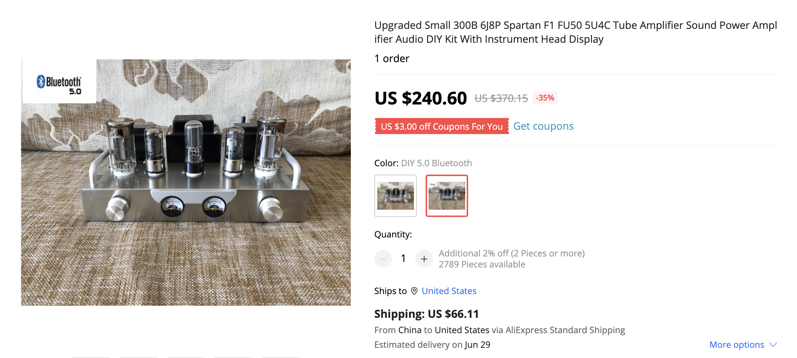

# 胆机DIY 

[电子管声频放大器实用手册.pdf](../../res/files/电子管声频放大器实用手册.pdf)  

</img>  

## 元器件基础知识 
### 电子管 
真空管（英语：Vacuum Tube）是一种在电路中控制电子流动的电子元件。参与工作的电极被封装在一个真空的容器内（管壁大多为玻璃），因而得名[1]。在中国大陆，真空管则会被称为“电子管”。电子工业早期年代，在香港和广东省，真空管会被称作“胆”。一般来说真空管内都是真空。但随着发展也不一定：有充气震荡管、充气稳压管及水银整流管。

在二十世纪中期前，因半导体尚未普及，基本上当时所有的电子器材都使用真空管，形成了当时对真空管的需求。但在半导体技术的发展普及和平民化下，真空管因成本高、不耐用、体积大、效能低等原因，最后被半导体取代了。但是可以在音响扩大机、微波炉及人造卫星的高频发射机看见真空管的身影；许多音响特别使用真空管是因为其特殊音质，在音响界、老旧的真空管常与最新的数位IC共存。另外，像是电视机与电脑阴极射线管显示器内的阴极射线管以及X光机的X射线管等则是属于特殊的真空管。

对于大功率放大（如百万瓦电台）及卫星（微波大功率）而言，大功率真空管及行波管仍是唯一的选择。对于高频电焊机及X射线机，它仍是主流器件。  

以上就是号称梦幻之球、不朽的音响神话的300B。

#### 6J8P

