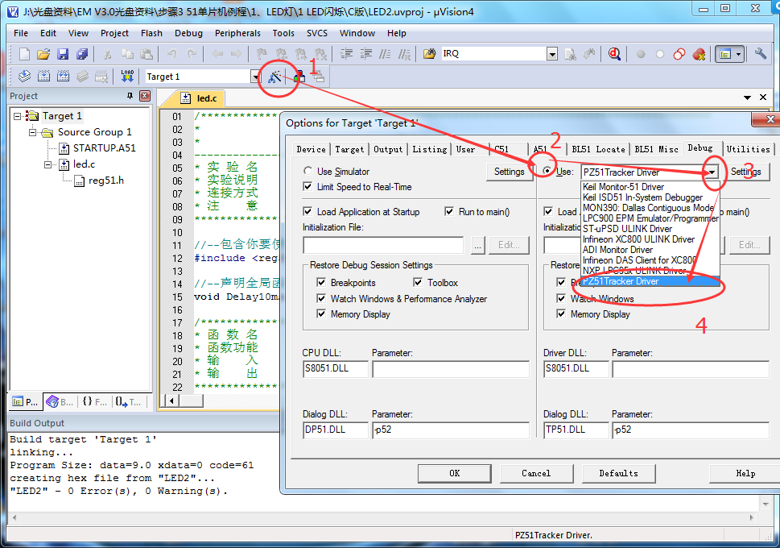

# 51-开发板学习 

[STC89Cxx中文参考手册](../../res/files/STC89Cxx中文参考手册.pdf)  

### [ :point_right: 实验记录](../../md/mcu-learn/shiyan.md)  

## 简介 

 

</img>  

 

 

</img>  

 

## 原理图

 

</img>  

 

 

</img>  

 

## Debug  
- ### CH340 驱动安装 

首先，拿到开发板，我们要安装下 USB 转串口 CH340 驱动，对于大多数电
脑系统，将 USB 线连接电脑和开发板的 USB 接口后会自动检测安装 CH340 驱动，
如果您的电脑没有自动安装 CH340 驱动，没关系，我们可以手动安装，打开资
料目录“\5--开发工具\2-开发板 CH340 驱动” 

 

</img>  

 

> 安装USB转串口工具后，就可以进行程序烧录了。  

- ### 程序的烧录（下载）  

安装好 CH340 驱动后，我们就可以下载程序了，在下载程序前先确认下开
发板上的 USB 转 TTL 串口模块上的 P5 端子短接片是否短接好（即 P31T 与 URXD
连接，P30R 与 UTXD 连接），出厂的时候该短接片默认已经短接好。 

 

</img>  

 

 
选择芯片类型、串口、波特率、下载hex文件，最终点击程序下载。  

</img>  

 

- ###  51 仿真器调试  

可使用普中 51 仿真器插入单片机座进行在线调试（前提需购买普中 51 仿真
器），但是需要在 KEILC51 软件内设置。 

</img>  

 

> 上方USB口朝着数码管，下方凹口朝着紧锁座把手进行安装，如果装反可能会导致仿真器烧坏的情况。

连接好硬件之后继续安装驱动（其它的型号的开发板上的仿真器接法和这个接法一样，仿真器的放置方向和单片机的放置方向根据凹口来看是一致的，还可以根据仿真器底部的引脚表示进行判断的）

安装驱动后，可以在驱动管理其中查看该设备，或者在keil中找到该设备: 

</img>  

 

</img>  

 

- ### 使用keil调试  
第一步：打开一个能够编译通过的项目工程  

</img>  

 

第二步：进入KEIL硬件仿真设置  

</img>  

 

</img>  

 

</img>  

 

根据上图从1到9步骤设置完成之后就可以进行在线仿真调试了
第三步：在keil里面调试程序，点工具栏的start debug  开始调试，如果退出也是点这个按钮  

</img>  

 

</img>  

 

当然，硬件仿真和软件仿真的操作是一样的，但是硬件仿真可以实时的显示程序运行的状态，可以更好更快的调试程序。   

