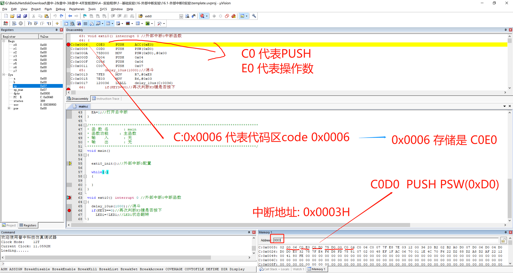

# 实验记录  

## 2-点亮第一个LED  

- ### 51 单片机 
```c
/**************************************************************************************
实验名称：点亮第一个LED
接线说明：	
实验现象：下载程序后“LED模块”的D1指示灯点亮
注意事项：																				  
***************************************************************************************/
#include "reg52.h"

sbit LED1=P2^0;	//将P2.0管脚定义为LED1

/*******************************************************************************
* 函 数 名       : main
* 函数功能		 : 主函数
* 输    入       : 无
* 输    出    	 : 无
*******************************************************************************/
void main()
{
	LED1=0;	//LED1端口设置为低电平
	while(1)
	{
		
	}		
}
```

- ### 树莓派4B 

```c

```


- ### 16-外部中断实验  

<div align=center>
</img>  
</div>

<div align=center>
</img>  
</div>

<br>
<div align=center>
</img>  
</div>
<br>

> 比如中断1的中断向量地址为0003H，那么就是代码区:`0003`, 从截图可知`0003`~`000`5存储为`02 00 06`, 这就意味着中断1跳向的地址为`0006`,翻译为： `LJMP exti0(0006)`  

```c
/**************************************************************************************
实验名称：外部中断0实验
接线说明：	
实验现象：下载程序后，当按下K3键可控制D1指示灯亮灭
注意事项：将红外接收传感器取下，防止对P3.2口干扰																				  
***************************************************************************************/
#include "reg52.h"

typedef unsigned int u16;	//对系统默认数据类型进行重定义
typedef unsigned char u8;

//定义LED1管脚
sbit LED1=P2^0;

//定义独立按键K3控制脚
sbit KEY3=P3^2;


/*******************************************************************************
* 函 数 名       : delay_10us
* 函数功能		 : 延时函数，ten_us=1时，大约延时10us
* 输    入       : ten_us
* 输    出    	 : 无
*******************************************************************************/
void delay_10us(u16 ten_us)
{
	while(ten_us--);	
}

/*******************************************************************************
* 函 数 名       : exti0_init
* 函数功能		 : 外部中断0配置函数
* 输    入       : 无
* 输    出    	 : 无
*******************************************************************************/
void exti0_init(void)
{
	IT0=1;//跳变沿触发方式（下降沿）
	EX0=1;//打开INT0的中断允许
	EA=1;//打开总中断
}

/*******************************************************************************
* 函 数 名       : main
* 函数功能		 : 主函数
* 输    入       : 无
* 输    出    	 : 无
*******************************************************************************/
void main()
{	
	
	exti0_init();//外部中断0配置

	while(1)
	{			
							
	}		
}

void exti0() interrupt 0 //外部中断0中断函数
{
	delay_10us(1000);//消斗
	if(KEY3==0)//再次判断K3键是否按下
		LED1=!LED1;//LED1状态翻转					
}
```

- ### 17-定时器实验  

<br>
<div align=center>
</img>  
</div>
<br>

> 定时器的中断向量地址为: `000B`， 存储的内容为`02 00 0E`也就是`LJMP 000E`  

```c
/**************************************************************************************
实验名称：定时器0实验
接线说明：	
实验现象：下载程序后，D1指示灯间隔1s闪烁
注意事项：																				  
***************************************************************************************/
#include "reg52.h"

typedef unsigned int u16;	//对系统默认数据类型进行重定义
typedef unsigned char u8;

//定义LED1管脚
sbit LED1=P2^0;


/*******************************************************************************
* 函 数 名       : delay_10us
* 函数功能		 : 延时函数，ten_us=1时，大约延时10us
* 输    入       : ten_us
* 输    出    	 : 无
*******************************************************************************/
void delay_10us(u16 ten_us)
{
	while(ten_us--);	
}

/*******************************************************************************
* 函 数 名       : time0_init
* 函数功能		 : 定时器0中断配置函数，通过设置TH和TL即可确定定时时间
* 输    入       : 无
* 输    出    	 : 无
*******************************************************************************/
void time0_init(void)
{
	TMOD|=0X01;//选择为定时器0模式，工作方式1
	TH0=0XFC;	//给定时器赋初值，定时1ms
	TL0=0X18;	
	ET0=1;//打开定时器0中断允许
	EA=1;//打开总中断
	TR0=1;//打开定时器		
}

/*******************************************************************************
* 函 数 名       : main
* 函数功能		 : 主函数
* 输    入       : 无
* 输    出    	 : 无
*******************************************************************************/
void main()
{	
	time0_init();//定时器0中断配置

	while(1)
	{			
							
	}		
}

void time0() interrupt 1 //定时器0中断函数
{
	static u16 i;//定义静态变量i
	TH0=0XFC;	//给定时器赋初值，定时1ms
	TL0=0X18;
	i++;
	if(i==1000)
	{
		i=0;
		LED1=!LED1;	
	}						
}
```

- ### 18-串口通信实验  

```c
/**************************************************************************************
实验名称：串口通信实验
接线说明：	
实验现象：下载程序后，当串口助手发送数据给单片机，单片机原封不动转发给串口助手显示
注意事项：使用黄色跳线帽将CH340旁的P5端子的UTX和P30短接，URX和P31短接，出厂默认已短接好																				  
***************************************************************************************/
#include "reg52.h"

typedef unsigned int u16;	//对系统默认数据类型进行重定义
typedef unsigned char u8;


/*******************************************************************************
* 函 数 名       : uart_init
* 函数功能		 : 串口通信中断配置函数，通过设置TH和TL即可确定定时时间
* 输    入       : baud：波特率对应的TH、TL装载值
* 输    出    	 : 无
*******************************************************************************/
void uart_init(u8 baud)
{
	TMOD|=0X20;	//设置计数器工作方式2
	SCON=0X50;	//设置为工作方式1
	PCON=0X80;	//波特率加倍
	TH1=baud;	//计数器初始值设置
	TL1=baud;
	ES=1;		//打开接收中断
	EA=1;		//打开总中断
	TR1=1;		//打开计数器		
}

/*******************************************************************************
* 函 数 名       : main
* 函数功能		 : 主函数
* 输    入       : 无
* 输    出    	 : 无
*******************************************************************************/
void main()
{	
	uart_init(0XFA);//波特率为9600

	while(1)
	{			
							
	}		
}

void uart() interrupt 4 //串口通信中断函数
{
	u8 rec_data;

	RI = 0;			//清除接收中断标志位
	rec_data=SBUF;	//存储接收到的数据
	SBUF=rec_data;	//将接收到的数据放入到发送寄存器
	while(!TI);		//等待发送数据完成
	TI=0;			//清除发送完成标志位				
}
```
- ### 23-ADC模数转换实验  

<div align=center>
</img>  
</div>

<div align=center>
</img>  
</div>

<div align=center>
</img>  
</div>

```c
/**************************************************************************************
实验名称：ADC模数转换实验--电位器电压采集
接线说明：	
实验现象：下载程序后，数码管上显示AD模块采集电位器的电压值
注意事项：																				  
***************************************************************************************/
#include "public.h"
#include "smg.h"
#include "xpt2046.h"


/*******************************************************************************
* 函 数 名       : main
* 函数功能		 : 主函数
* 输    入       : 无
* 输    出    	 : 无
*******************************************************************************/
void main()
{	
	u16 adc_value=0;
	float adc_vol;//ADC电压值
	u8 adc_buf[3];

	while(1)
	{				
		adc_value=xpt2046_read_adc_value(0x94);//测量电位器
		adc_vol=5.0*adc_value/4096;//将读取的AD值转换为电压
		adc_value=adc_vol*10;//放大10倍，即保留小数点后一位
		adc_buf[0]=gsmg_code[adc_value/10]|0x80;
		adc_buf[1]=gsmg_code[adc_value%10];
	   	adc_buf[2]=0x3e;//显示单位V
		smg_display(adc_buf,6);		
	}		
}

```
- ### 24-DAC数模转换实验  

<div align=center>
</img>  
</div>

<div align=center>
</img>  
</div>

```c
/**************************************************************************************
实验名称：DAC模数转换实验
接线说明：	
实验现象：下载程序后，DAC(PWM)模块上的指示灯DA1呈呼吸灯效果，由暗变亮再由亮变暗
注意事项：																				  
***************************************************************************************/
#include "public.h"
#include "pwm.h"


/*******************************************************************************
* 函 数 名       : main
* 函数功能		 : 主函数
* 输    入       : 无
* 输    出    	 : 无
*******************************************************************************/
void main()
{	
	u8 dir=0;//默认为0
	u8 duty=0;

	pwm_init(0XFF,0XF6,100,0);//定时时间为0.01ms，PWM周期是100*0.01ms=1ms，占空比为0%

	while(1)
	{
		if(dir==0)//当dir为递增方向
		{
			duty++;//占空比递增
			if(duty==70)dir=1;//当到达一定值切换方向，占空比最大能到100，但到达70左右再递增，
								//肉眼也分辨不出亮度变化	
		}
		else
		{
			duty--;
			if(duty==0)dir=0;//当到达一定值切换方向	
		}
		pwm_set_duty_cycle(duty);//设置占空比
		delay_ms(1);//短暂延时，让呼吸灯有一个流畅的效果			
	}
}
```