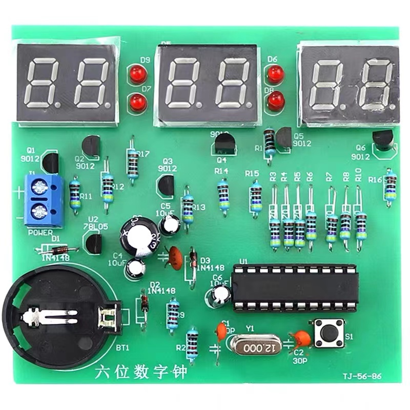
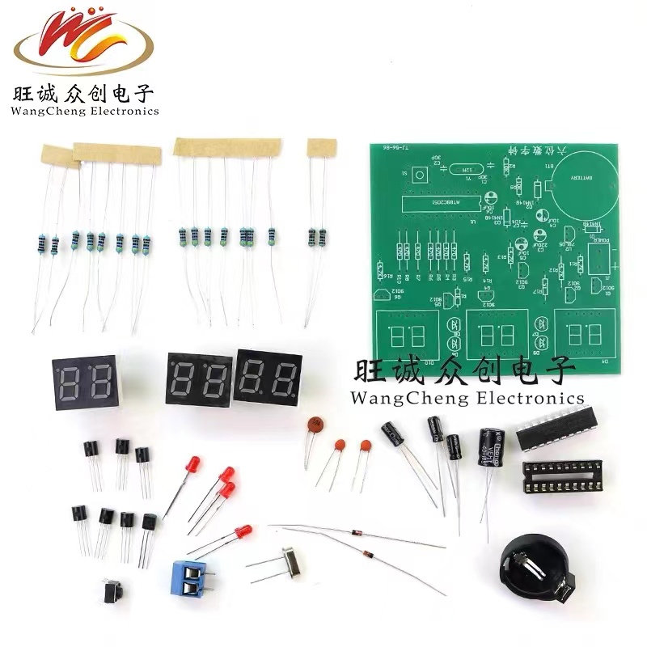
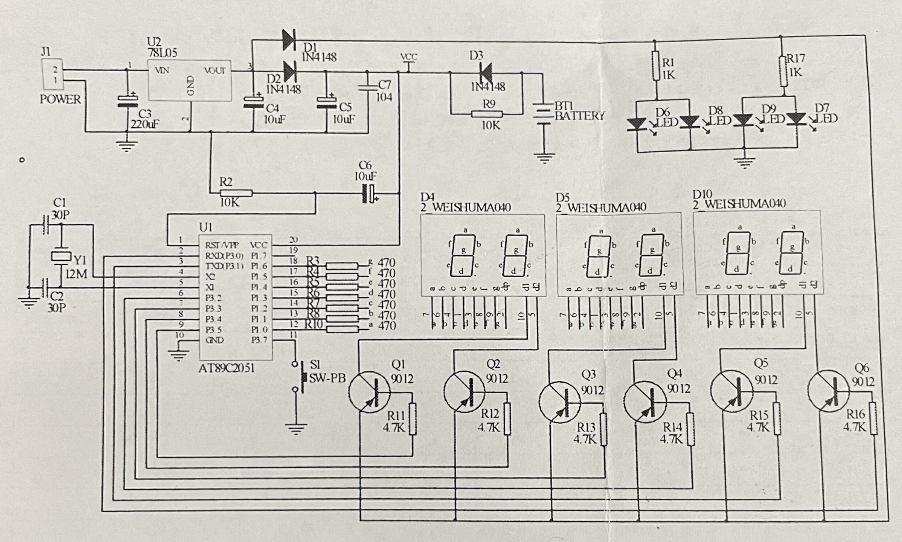
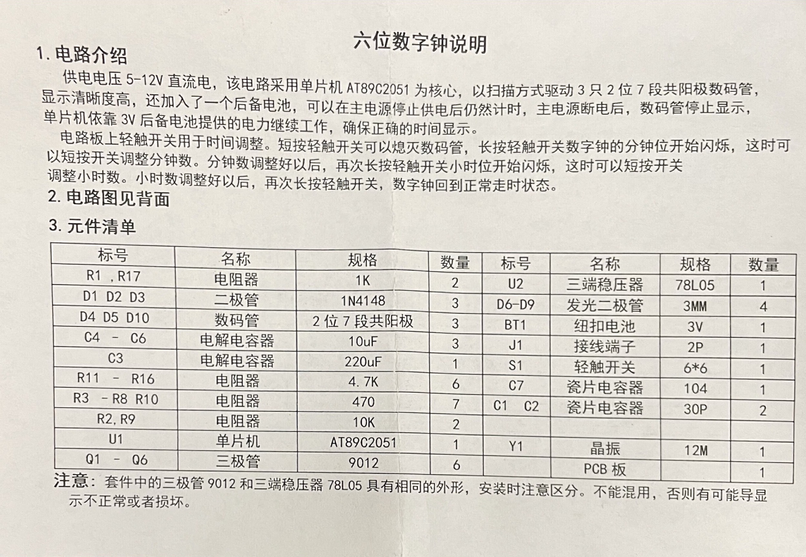
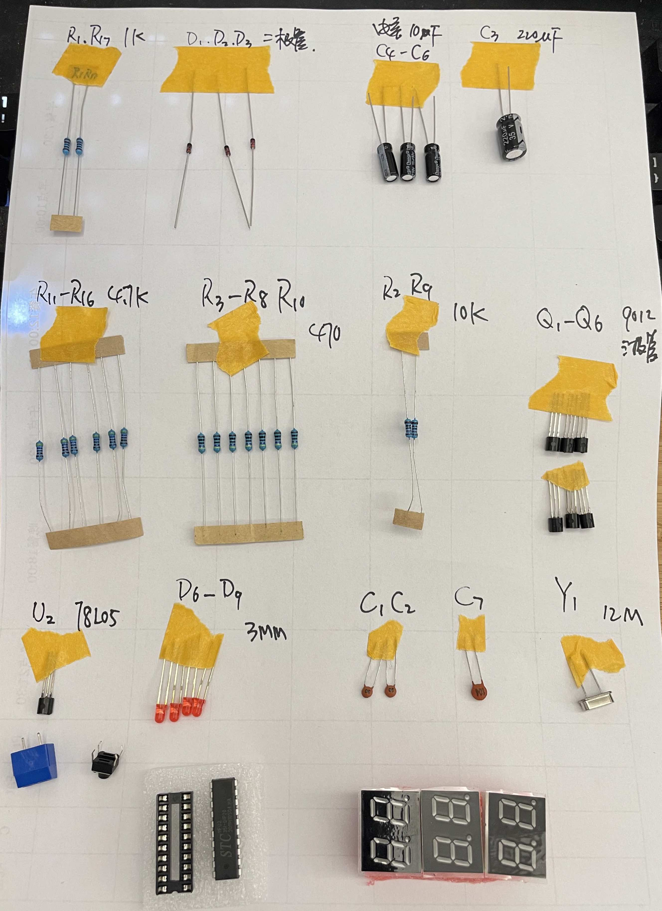
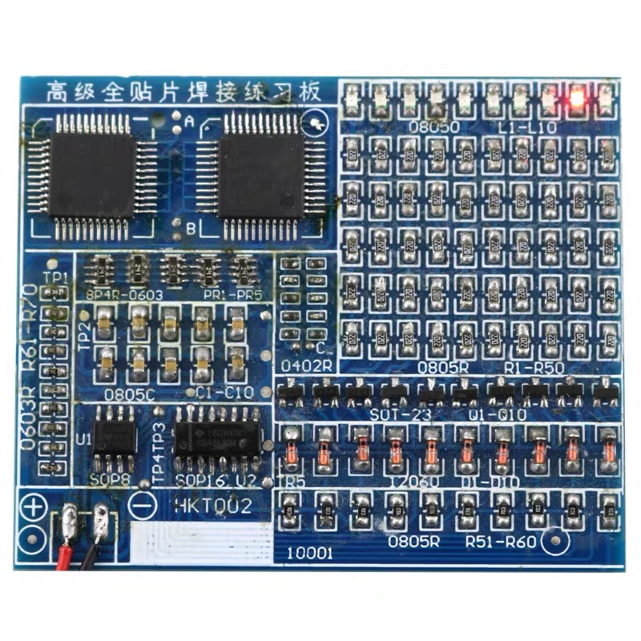
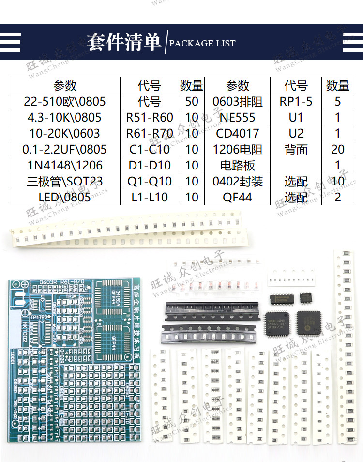
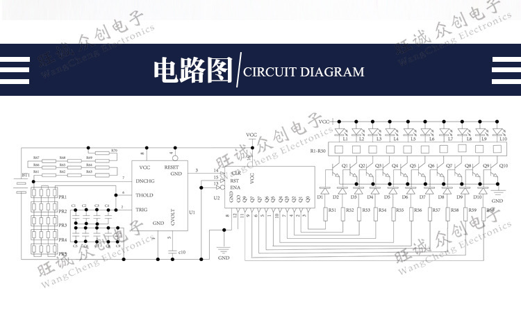
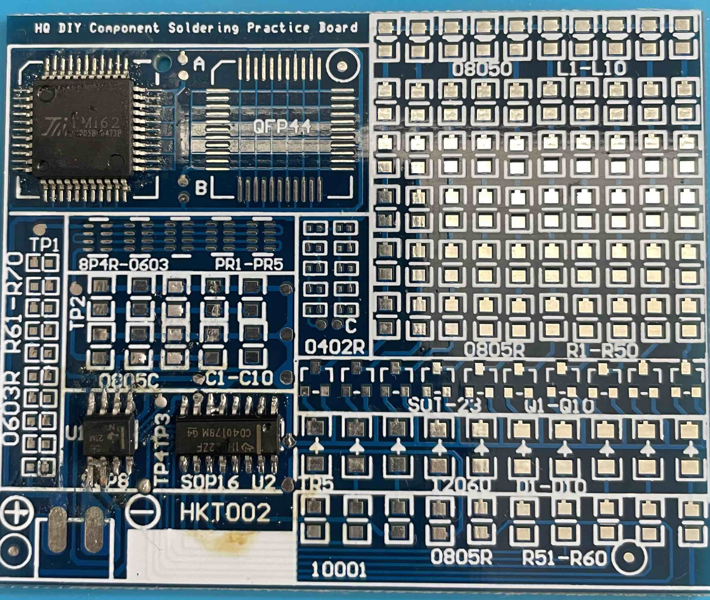

# 练习板及焊接学习

## 六位数字钟(直插元器件焊接)  
### [STC11F-10Fxx 中文手册](../res/files/stc/STC11F-10Fxx.pdf)  

### 元器件及电路图 

</img>  

 

</img>  

 

</img>  

 

</img>  

### 元器件焊接 

</img>  

### 总结

#### 焊接完后，只有四个二极管是亮的？  

有一个二极管正负极反了，查了三天呀！  

## 贴片元器件练习板 

### 说明

</img>  

</img>  

</img>  

### 贴片元器件焊接学习 
[参考视频](https://www.bilibili.com/video/BV1SQ4y1e7VA?spm_id_from=333.337.search-card.all.click)  

- 先给焊盘上锡，再去固定一侧
- 如果是封装好的芯片，使用脱焊的方法
- 如果使用电洛铁不方便，也可以使用中温焊膏+热风枪(风速要小)  

</img>  

