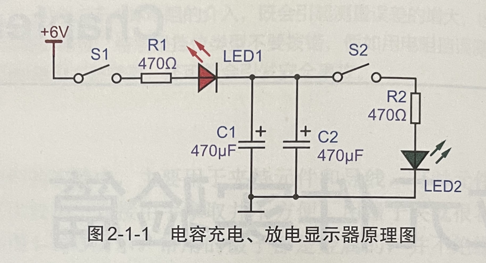
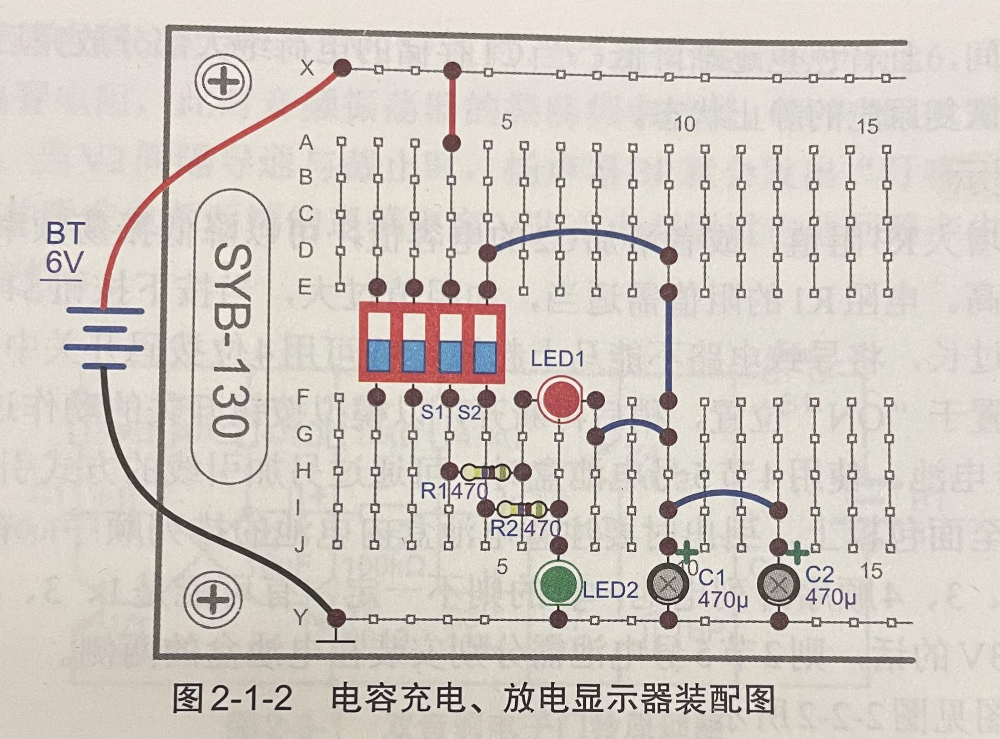

# 面包板电子制作130

## 元器件

<br>
<div align=center>
</img>  
</div>
<br>

### CMOS数字集成电路
`4011` `4013` `4017` `4069`

### 555时基集成电路  

## 分立元件实验篇
### 电容充电、放电显示器 

- 制作难度：✮ 简单  
- 原理简介  
  
这是一个能够显示电容充电和放电过程的简单电路，电路原理见图2-1-1所
示。电路的左边部分S1、R1、LED1和电解电容C1、C2组成充电电路，充电电
流由红色发光二极管LED1 显示出来。电路图的右边部分 S2、R2、LED2和C1、
c2组成放电电路，放电电流由绿色发光二极管LED2显示。  

当 S1 闭合时，电源通过RI、LED1 向电容CI、c2充电，在接通电源瞬间，
由手C1、c2中没有电荷，其两端电压为零，这时通过红色发光二极管LED1的电流最大，发光亮度最高。电阻R1具有限流作用，阻得电源向电容充电，RI
的电阻值越大，LED1瞬间电流越小，但发光时间延长，也就是电容的充电时间
越长。随着时间的推移，电容逐渐充满电荷，充电电流逐渐减少，红色发光二
极管LED1逐渐熄灭。  


<br>
<div align=center>
</img>  
</div>
<div align=center><span> 图2-1-1 电容充电、放电显示器原理图 </span></div>
<br>


当电容C1、C2充满电荷后，断开S1，此时f C1、C2与电源脱离，这时，闭
合S2，绿色发光二极管LED2开始点光发北，表明电容CI、C2开始放电，以此
可以表明电容具有存储电荷的能力。电容放电时，随者存储的电荷不断减少，
其两端电压也迅速下降，放电电流也随之按指数规律急刷减少。LED2 的亮度也
由最亮迅速变暗并最终媳灭。电容的容量越大，且限流电阳R2的阻值越大，电
容的放电时间就越长，LED2点亮的持续时间就越长。  
通过以上的描述可知，限流电阻R1（或R2）的电阻值与电容CI、C2两者
的乘积，即RC越大，充、放电所需的时间也越长，因此把RC的乘积叫做阻容
充放电电路的时间常数，用希腊字母r来表示，即  
```
T=RC  
```
公式中电阻的单位是2，电容的容量是F，r的单位是s。这个定理广泛应用
手各种含有阻容充放电的电路中。  

- 装调提示  

电路中采用了两只电解电容并联，目的是为了提高总电容容量，以延长演
示的时间，以便更为直观地观察电容的充电、放电过程。两只470uF 的电容
并联，其总电容为2×470uF=960uF。 470uF 电解电容的体积稍大，装配时注
意2只电容要留有一定的间隔空间。实验开始时，S1、S2均先处于断开状态，
先闭合S1，待充电过程结束后，再断开S1，然后闭合S2，待放电结束后，再
断开S2。S1、S2 不能同时处于闭合状态。S1、S2可用4位拨码开关中的任意2
位代用。  
装配图见图2-1-2所示。

<br>
<div align=center>
</img>  
</div>
<div align=center><span> 图2-1-2 电容充电、放电显示器装配图 </span></div>
<br>  

- 电容电压问题  
没有上电前，使用万用表的电压档，测试电容电压为零，等闭合S1时，电容的电压为1.9V, 断开S1后，电压让保持1.9V, 正负极接在一起对电容放电时，电压为0 

- 470电阻没有电压？二极管电压为1.4V?  


红黄一般是1.8至2.2，蓝绿一般是3.0至3.6，电流小功率的都尽量控制在20MA  


## 555 集成电路实验篇

## 数字电路实验篇


