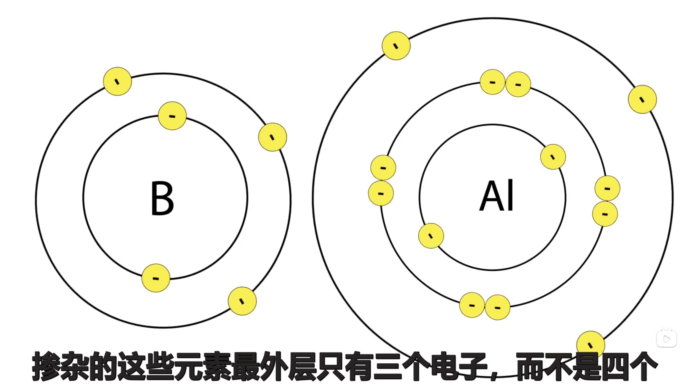
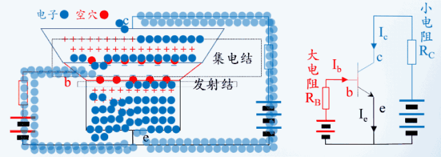

# 面包板电子制作130

## 元器件

<br>
<div align=center>
</img>  
</div>
<br>

### CMOS数字集成电路
`4011` `4013` `4017` `4069`

### 555时基集成电路  

## 分立元件实验篇  
## 电路基础知识
- 电子运动的方向： 从电源的正极流向负极
- 电流方向： 电子运动的反方向，电流的概念是实际是不存在，只是一个物理概念。  

<br>
<div align=center>
</img>  
</div>
<br>

- 电源充电：

<br>
<div align=center>
</img>  
</div>
<br>

<br>
<div align=center>
</img>  
</div>
<br>


### 电容充电、放电显示器 

我们知道，电容C=Q/U（Q电荷，U电压），不难推导出（因为I=dQ/dt，Z=U/I），电容的阻抗为Z=1/jwC（w=2πf 角频率）  
可见，频率越高，则电容阻抗越小。所以，通俗的来说，电容有“隔直通交”的作用（直流频率为0，交流频率各异）  

- 滤波  

滤波，是电容最重要的用途之一。我们知道电容可以存储电荷，简单去理解滤波： 
当输入电压比电容两端电压大时，电荷进入电容（充电），电容电压升高，充电需要时间，从而电压是缓慢上升的；当输入电压变小时（输入切断或者回路中有耗电元件）小于电容两端电压，电荷流出电容（放电），电压缓慢下降。这个充放电的时间与电容值和充放电环路的电阻有关，电容越大，充放电时间越长。所以一般用大电容值的电解电容来实现滤波（电路里看到大大的柱状电容），充放电时间越长，就允许更剧烈的电压变化。  

- 隔直流

- 调谐  

最简单的来说，`LC振荡电路`知道吧，电容与电感配合，提供谐振点，改变电路性能  


- 储能

把能量存储起来，慢慢/迅速释放。比如，瞬间高温杀菌，尖峰电压发生器，还有相机的闪光灯。  

----
#### 电容实验  

- 制作难度：✮ 简单  
- 原理简介  
  
这是一个能够显示电容充电和放电过程的简单电路，电路原理见图2-1-1所
示。电路的左边部分S1、R1、LED1和电解电容C1、C2组成充电电路，充电电
流由红色发光二极管LED1 显示出来。电路图的右边部分 S2、R2、LED2和C1、
c2组成放电电路，放电电流由绿色发光二极管LED2显示。  

当 S1 闭合时，电源通过RI、LED1 向电容CI、c2充电，在接通电源瞬间，
由手C1、c2中没有电荷，其两端电压为零，这时通过红色发光二极管LED1的电流最大，发光亮度最高。电阻R1具有限流作用，阻得电源向电容充电，RI
的电阻值越大，LED1瞬间电流越小，但发光时间延长，也就是电容的充电时间
越长。随着时间的推移，电容逐渐充满电荷，充电电流逐渐减少，红色发光二
极管LED1逐渐熄灭。  


<br>
<div align=center>
</img>  
</div>
<div align=center><span> 图2-1-1 电容充电、放电显示器原理图 </span></div>
<br>


当电容C1、C2充满电荷后，断开S1，此时f C1、C2与电源脱离，这时，闭
合S2，绿色发光二极管LED2开始点光发北，表明电容CI、C2开始放电，以此
可以表明电容具有存储电荷的能力。电容放电时，随者存储的电荷不断减少，
其两端电压也迅速下降，放电电流也随之按指数规律急刷减少。LED2 的亮度也
由最亮迅速变暗并最终媳灭。电容的容量越大，且限流电阳R2的阻值越大，电
容的放电时间就越长，LED2点亮的持续时间就越长。  
通过以上的描述可知，限流电阻R1（或R2）的电阻值与电容CI、C2两者
的乘积，即RC越大，充、放电所需的时间也越长，因此把RC的乘积叫做阻容
充放电电路的时间常数，用希腊字母r来表示，即  
```
T=RC  
```
公式中电阻的单位是2，电容的容量是F，r的单位是s。这个定理广泛应用
手各种含有阻容充放电的电路中。  

- 装调提示  

电路中采用了两只电解电容并联，目的是为了提高总电容容量，以延长演
示的时间，以便更为直观地观察电容的充电、放电过程。两只470uF 的电容
并联，其总电容为2×470uF=960uF。 470uF 电解电容的体积稍大，装配时注
意2只电容要留有一定的间隔空间。实验开始时，S1、S2均先处于断开状态，
先闭合S1，待充电过程结束后，再断开S1，然后闭合S2，待放电结束后，再
断开S2。S1、S2 不能同时处于闭合状态。S1、S2可用4位拨码开关中的任意2
位代用。  
装配图见图2-1-2所示。

<br>
<div align=center>
</img>  
</div>
<div align=center><span> 图2-1-2 电容充电、放电显示器装配图 </span></div>
<br>  

- 电容电压问题  
没有上电前，使用万用表的电压档，测试电容电压为零，等闭合S1时，电容的电压为1.9V, 断开S1后，电压让保持1.9V, 正负极接在一起对电容放电时，电压为0 

- 470电阻没有电压？二极管电压为1.4V?  
使用万用表测量没有电压，使用示波器测量有3.3V的电压，为什么？

二极管电压:
红黄一般是1.8至2.2，蓝绿一般是3.0至3.6，电流小功率的都尽量控制在20MA  

### 电阻 

### 二极管 
首先理解PN区域的物理结构： 

首先了解`Si`硅元素的物理结构,最外层有四个电子： 

<br>
<div align=center>
</img>  
</div>
<br>

如果把硅、硼、铝掺杂在一起，他们最层有三个电子：

<br>
<div align=center>
</img>  
</div>
<br>

这样就形成`3+4=7`的状态，少了一个电子，形成一个空穴(正极)
<br>
<div align=center>
</img>  
</div>
<br>


如果在N型区，用硅和磷、锑(tī)元素掺杂一起，多了一个电子，形成负极:
<br>
<div align=center>
</img>  
</div>
<br>

<br>
<div align=center>
</img>  
</div>
<br>

二极管单向导电性：
<br>
<div align=center>
</img>  
</div>
<br>

<br>
<div align=center>
</img>  
</div>
<br>

> 这样P区域就相当于正极，N相当于负极

二极管（英语：diode）又称二极体，是一种具有不对称电导的两个端子（阴阳二极接线端，故名“二极”）的电子器件；此二极使其原则上仅允许电流作单方向传导，它在一个方向为低电阻（理想情况下是零），而在另一个方向为高电阻（理想情况下是无限大）。现今，二极管常使用半导体材料。

借由二极管的特性，在电力工程上常用作`整流器（将交流电变成直流电）`；在电子工程上常用作`检波器（从调幅波检回音波）`；在计算机硬件逻辑设计上常用作逻辑电路的`逻辑闸`。   


<br>
<div align=center>
</img>  
</div>
<br>

> 电子运动的方向是`P->N`  


----


### 三极管
[参考视频](https://www.bilibili.com/video/BV1Qv411J7sj?spm_id_from=333.337.search-card.all.click)

<br>
<div align=center>
</img>  
</div>
<br>

> P 代表正电子多余负电子，N代表负电子多余正电子；集电极薄，阻值小；发射极厚，组织大   

三极管也叫双极型晶体管,模电的放大电路和数电的简单逻辑电路里面都会用到。有集电极c、基极b、发射极e、以及两个PN结：集电结和发射结。集电极面积比较大，基极厚度薄而且载流子浓度比较低。下图是个NPN型的三极管：

<br>
<div align=center>
</img>  
</div>
<br>

当发射结正偏时，电荷分布会发生变化，发射结宽度会变窄；相当于给电子打开了一扇e到b的大门  
集电结反偏时，电荷分布会也发生变化，集电结宽度会变宽。相当于打开了阻碍电子从c级跑出去的大门，如下方动画所示：  

<br>
<div align=center>
</img>  
</div>
<br>

b级会接一个大电阻RB限制电流Ib的大小，跑到b极的那些多余的电子就只好穿越集电结，形成电流Ic，如下方动画所示：  

<br>
<div align=center>
</img>  
</div>
<br>

如果基极电压翻倍，电荷分布会继续发生变化，发射结宽度会变得更窄，这扇大门变得更宽了，将会有更多的电子跑到b级。如下方动画所示：  

<br>
<div align=center>
</img>  
</div>
<br>

由于RB是大电阻，Ib就算翻倍了也还是很小，所以更多的电子会穿越集电结，让Ic也翻倍。如下方动画所示：

<br>
<div align=center>
</img>  
</div>
<br>

两个直流电源是可以合并到一起的，再加上小信号ui和两个电容，就得到了放大电路，如下图所示：  

<br>
<div align=center>
</img>  
</div>
<br>


## 555 集成电路实验篇

## 数字电路实验篇


