# 自己动手制作札记
### [宏晶STC单片机官方数据手册(DATASHEET)](https://www.stcisp.com/stcmcu-pdf.html)  
### [宏晶STC单片机官方数据手册(DATASHEET)-离线](res/files/stc)  

### [cpu自制入门电子书](https://github.com/ymm135/AZPRcpu/tree/master/book)  

### [入门-面包板电子制作130.md](md/面包板电子制作130.md)  
### [练习板及焊接学习](md/练习板及焊接学习.md)  
### [胆机DIY](md/audio/胆机DIY套件.md)  

## 基础知识(CPU逻辑电路)
### [冯·诺伊曼结构](https://zh.m.wikipedia.org/zh-hans/%E5%86%AF%C2%B7%E8%AF%BA%E4%BC%8A%E6%9B%BC%E7%BB%93%E6%9E%84)  
冯·诺伊曼结构（英语：Von Neumann architecture），也称冯·纽曼模型（Von Neumann model）或普林斯顿结构（Princeton architecture），是一种将程序指令存储器和数据存储器合并在一起的电脑设计概念结构。本词描述的是一种实作通用图灵机的计算装置，以及一种相对于平行计算的序列式架构参考模型（referential model）  

<div align=center>
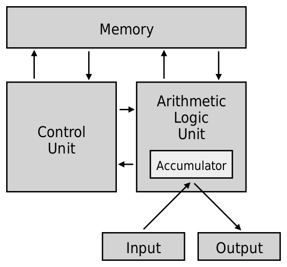</img>  
</div>

存储程序计算机在体系结构上主要特点有：

1. 以运算单元为中心
2. 采用存储程序原理
3. 存储器是按地址访问、线性编址的空间
4. 控制流由指令流产生
5. 指令由操作码和地址码组成
6. 数据以二进制编码

### TD4 结构

<div align=center>
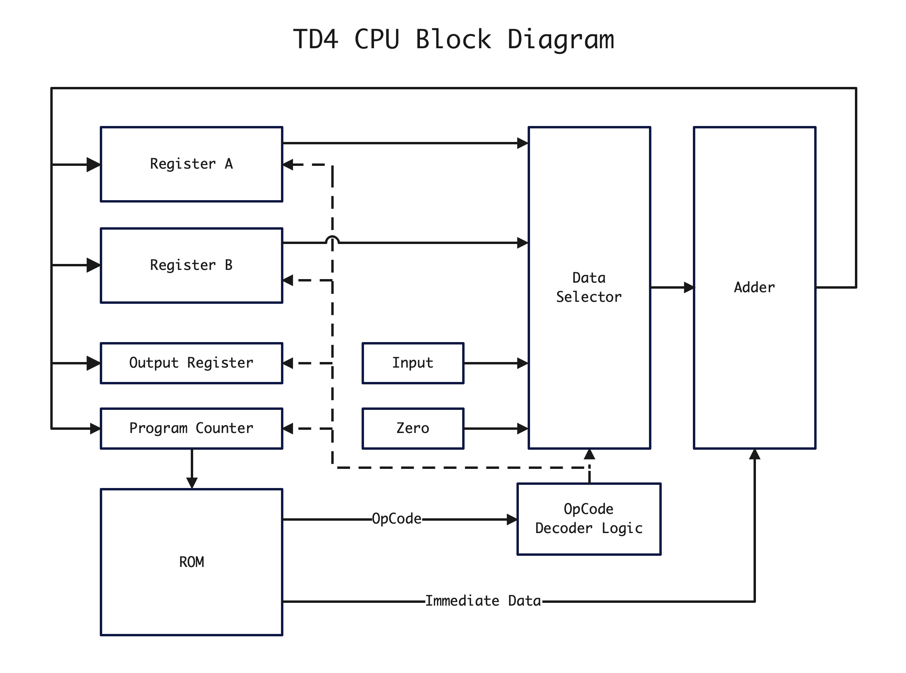</img>  
</div>

### 原理图 
[TD4-SCH.pdf](origin/hardware/v1.3/TD4-SCH.pdf)   

<div align=center>
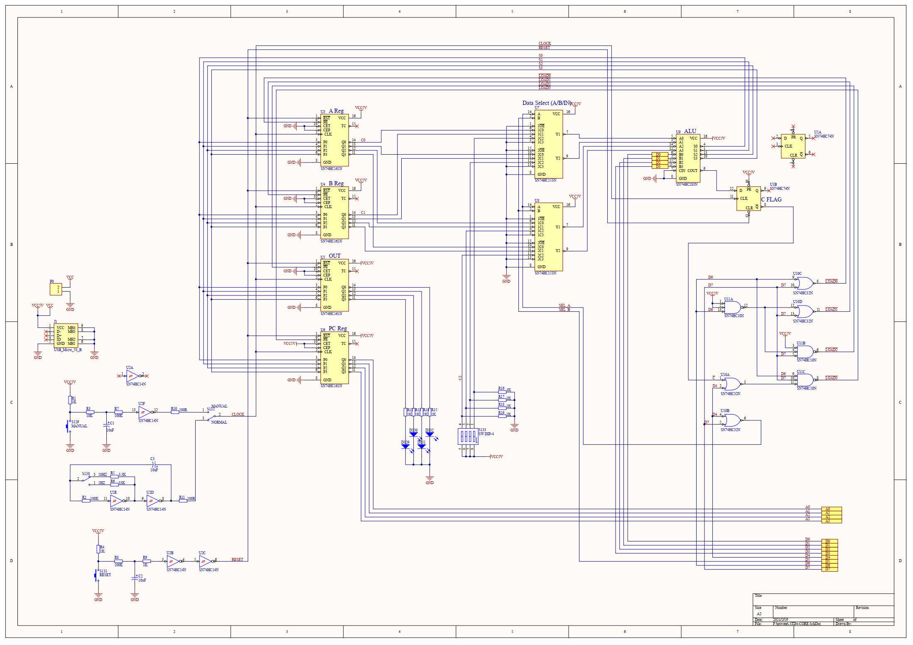</img>  
</div>

### PCB标识

Td4的PCB元器件标识  
<div align=center>
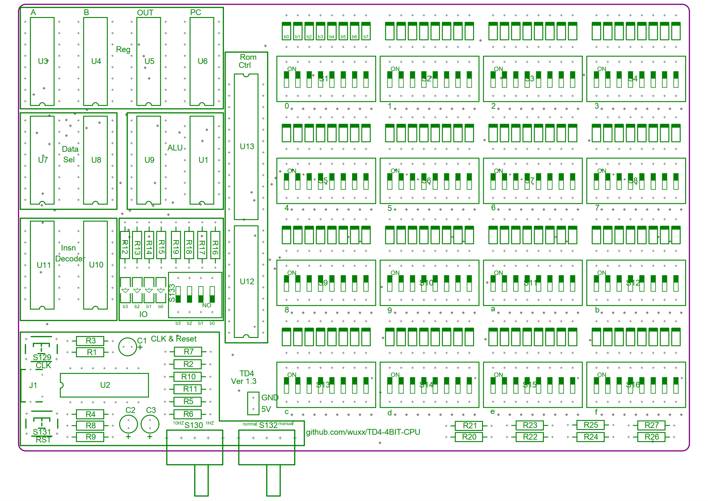</img>  
</div> 

### BOM 
[BOM](origin/hardware/v1.3/TD4-BOM.htm)  

| Designator | Comment  | LibRef  | Description | Quantity |
| ---------- | ------- | -------- | ---------- | --------- 
| U1  | SN74HC74N | SN74HC74N  | Dual D-Type Positive-Edge-Triggered Flip-Flop with Clear and Preset  | 1  |  
| U2  | SN74HC14N  | SN74HC14N  | Hex Schmitt-Trigger Inverter  | 1  |  
| U3  | SN74HC161N  | SN74HC161N  | 4-Bit Synchronous Binary Counter  | 1  |  
| U4  | SN74HC161N  | SN74HC161N  | 4-Bit Synchronous Binary Counter  | 1  |  
| U5  | SN74HC161N  | SN74HC161N  | 4-Bit Synchronous Binary Counter  | 1  |  
| U6  | SN74HC161N  | SN74HC161N  | 4-Bit Synchronous Binary Counter  | 1  |  
| U7  | SN74HC153N  | SN74HC153N  | Dual 4-Line to 1-Line Data Selector/Multiplexer  | 1  |  
| U8  | SN74HC153N  | SN74HC153N  | Dual 4-Line to 1-Line Data Selector/Multiplexer  | 1  |  
| U9  | SN74HC283N  | SN74HC283N  | 4-Bit Binary Full Adder with Fast Carry  | 1  |  
| U10 | SN74HC32N  | SN74HC32N  | Quadruple 2-Input Positive-OR Gate  | 1  |  
| U11 | SN74HC10N  | SN74HC10N  | Triple 3-Input Positive-NAND Gate  | 1  |  
| U12 | SN74HC540N  | SN74HC540N  | Octal Buffer and Line Driver with 3-State Outputs  | 1  |  
| U13 | SN74HC154NT  | SN74HC154NT  | 4-Line to 16-Line Decoder / Demultiplexer  | 1  |  

## 原理分析
### [数字逻辑设计](https://circuitverse.org/users/6130/projects/17074)  
<div align="center">
    <font face="黑体" color=gray size=3>TD4-HC161</font> 
</div>
<div align=center>
    </img>  
</div>
<br>

<div align="center">
    <font face="黑体" color=gray size=3>TD4-HC153</font> 
</div>
<div align=center>
    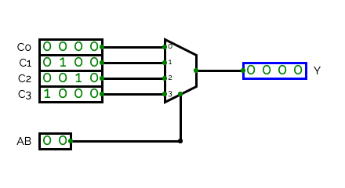</img>  
</div>
<br>

<div align="center">
    <font face="黑体" color=gray size=3>TD4-ALU</font> 
</div>
<div align=center>
    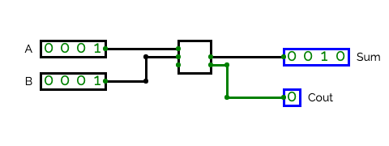</img>  
</div>
<br>

<div align="center">
    <font face="黑体" color=gray size=3>TD4-HC161PC</font> 
</div>
<div align=center>
    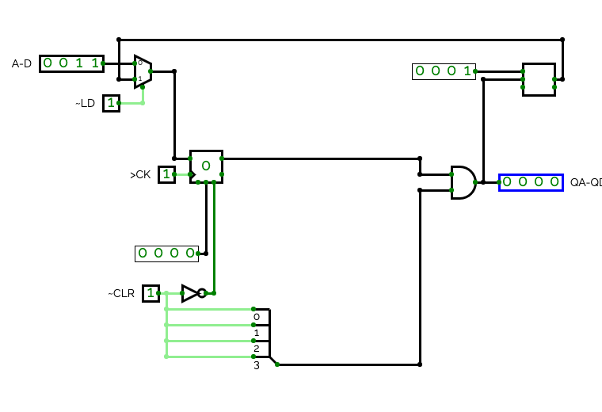</img>  
</div>
<br>

<div align="center">
    <font face="黑体" color=gray size=3>TD4-Decoder</font> 
</div>
<div align=center>
    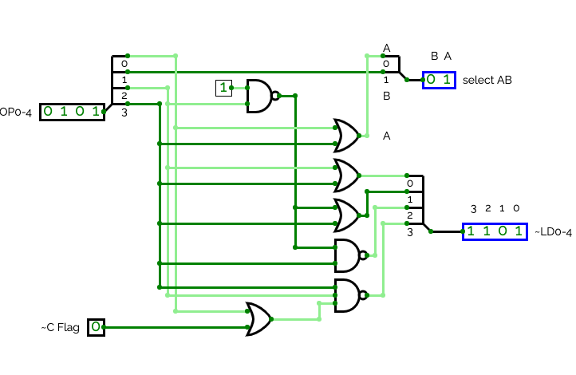</img>  
</div>
<br>

<div align="center">
    <font face="黑体" color=gray size=3>TD4-Main</font> 
</div>
<div align=center>
    </img>  
</div>
<br>


### 时钟、复位 

时钟及复位电路: 
<div align=center>
    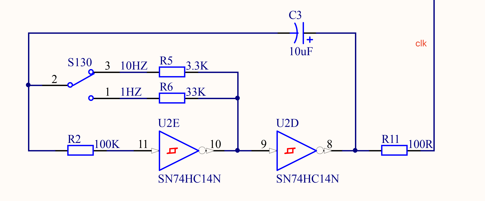</img>  
</div>
<br>

时钟电路细节: 
<div align=center>
    </img>  
</div>
<br>

10 HZ  宽度为100ms， 正脉宽56ms 负脉宽 47ms 
<div align=center>
    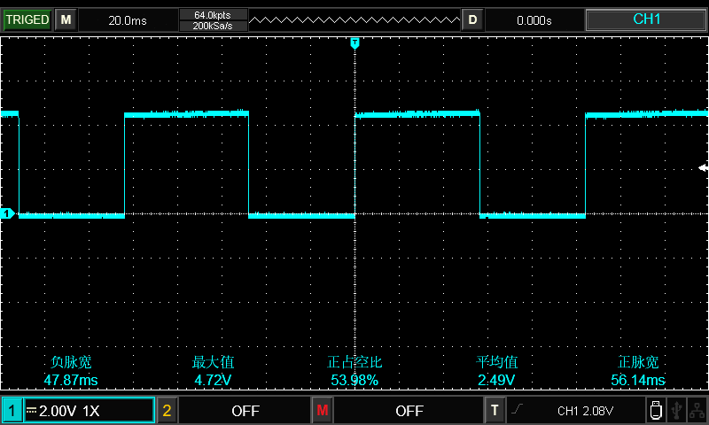</img>  
</div>
<br>

1HZ 宽度为1000ms
<div align=center>
    </img>  
</div>
<br>


### 存储器(SN74HC161N)   

<div align=center>
    </img>  
</div>
<br>

功能表:  
<div align=center>
    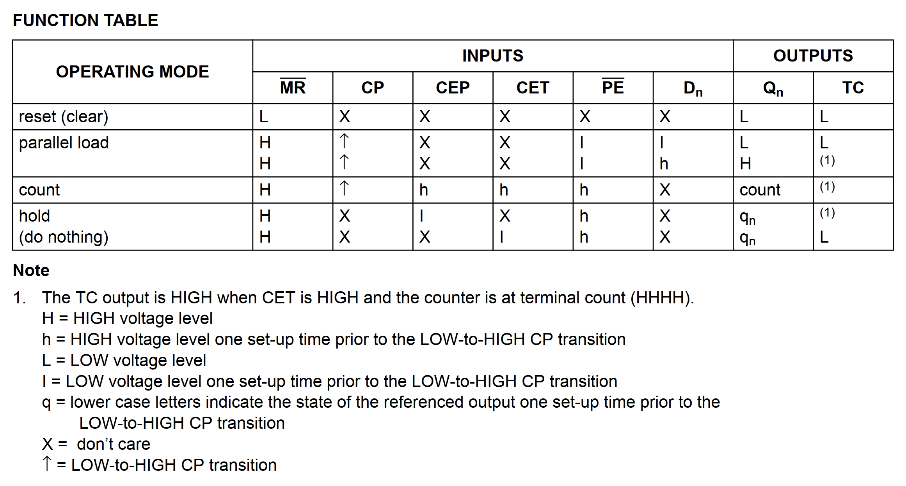</img>  
</div>
<br>


### 输入、输出  


### 控制器(74HC/HCT153) 
Dual 4-input multiplexer  

<div align=center>
    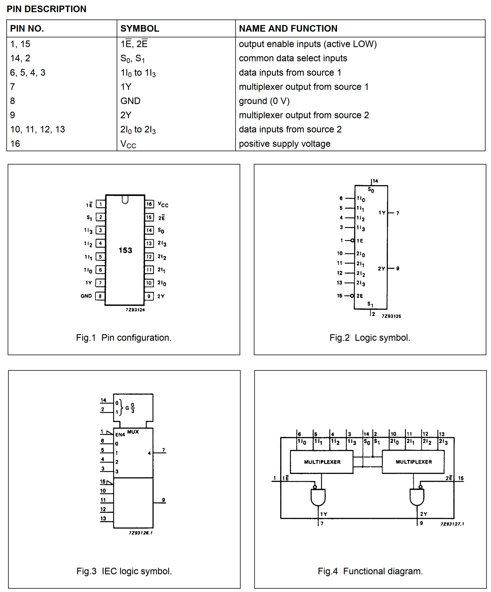</img>  
</div>
<br>

<div align=center>
    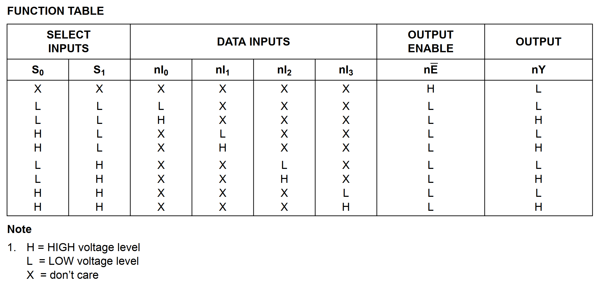</img>  
</div>
<br>

<div align=center>
    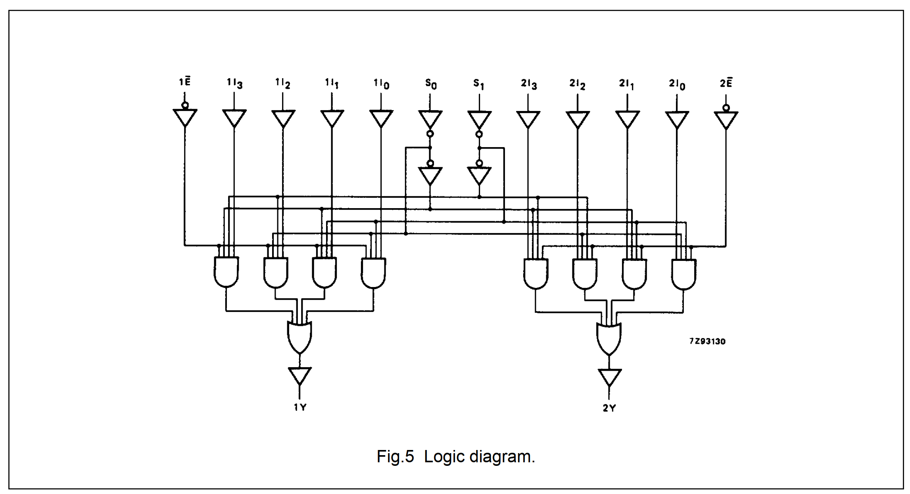</img>  
</div>
<br>


### 运算器(TC74HC283AFN)
4-Bit Binary Full Adder

<div align=center>
    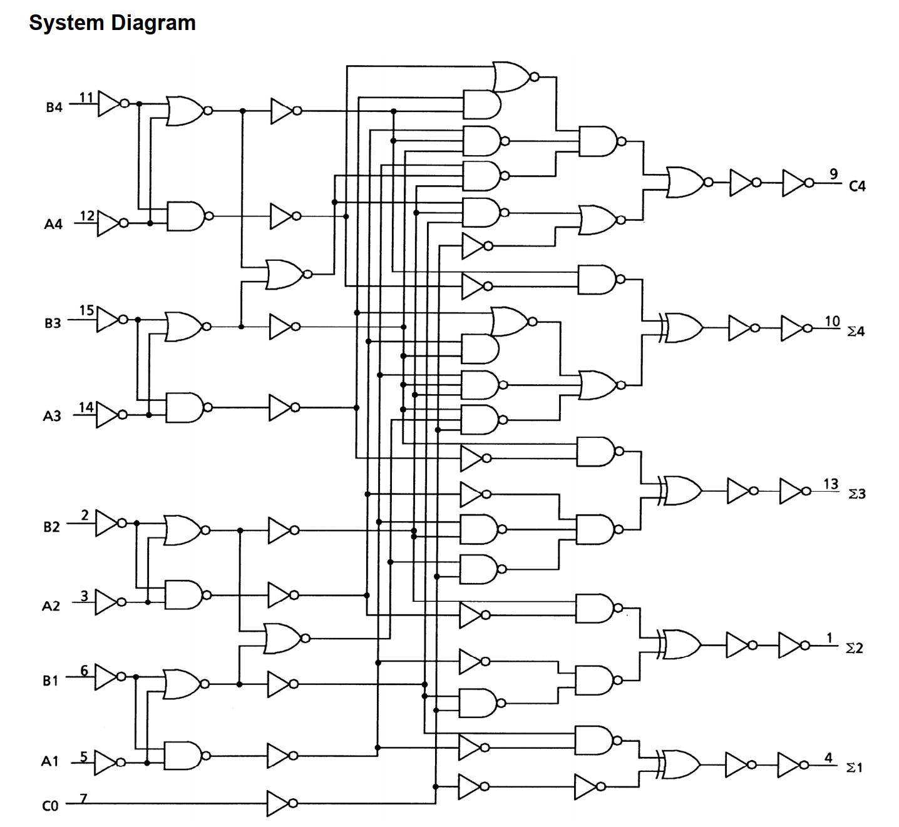</img>  
</div>
<br>


### 指令集 
| instruction | bit7-bit4 | bit3-bit0 | C | SEL_B | SEL_A | #LOAD0 | #LOAD1 | #LOAD2 | #LOAD3 
|:------------|:---------:|:----------|:-:|:------:|:-----:|:-----:|:------:|:------:|:------:|
|ADD A, Im    |0000       |Im         |X  |   L    |   L   |   L   |   H    |   H   |   H    |
|MOV A, B     |0001       |0000       |X  |   L    |   H   |   L   |   H    |   H   |   H    |
|IN  A        |0010       |0000       |X  |   H    |   L   |   L   |   H    |   H   |   H    |
|MOV A, Im    |0011       |Im         |X  |   H    |   H   |   L   |   H    |   H   |   H    |
|MOV B, A     |0100       |0000       |X  |   L    |   L   |   H   |   L    |   H   |   H    |
|ADD B, Im    |0101       |Im         |X  |   L    |   H   |   H   |   L    |   H   |   H    |
|IN  B        |0110       |0000       |X  |   H    |   L   |   H   |   L    |   H   |   H    |
|MOV B, Im    |0111       |Im         |X  |   H    |   H   |   H   |   L    |   H   |   H    |
|OUT B        |1001       |0000       |X  |   L    |   H   |   H   |   H    |   L   |   H    |
|OUT Im       |1011       |Im         |X  |   H    |   H   |   H   |   H    |   L   |   H    |
|JZ  Im       |1110       |Im         |L  |   H    |   H   |   H   |   H    |   H   |   L    |
|JZ  Im       |1110       |Im         |H  |   X    |   X   |   H   |   H    |   H   |   H    |
|JMP Im       |1111       |Im         |X  |   H    |   H   |   H   |   H    |   H   |   L    |

说明: `SEL_B` `SEL_A` 信号用于选择ALU的数据源，`#LOAD0`-`#LOAD3`则用于选择ALU的数据终点，说的官方一点，就是  
分别用于控制指令的`源操作数`和`目的操作数`。  

`A` `B`指的是寄存器AB, `IN A`是把输入拨码开关的值送入寄存器A中， `OUT B` 是输出寄存器B的内容    
> 读端口用IN指令，写端口用OUT指令。  

```
ADD   Adder 加法器，ADD B, Im 等效于 B = B + Im
JZ    Jump if Zero
JMP   JuMP
```

每次TD4能读取8个bit数据，`0~3`输入数据，会送到`ALU`，`4~7`连接的是控制器(数据选择器+控制电路)  
比如`ADD B, 0010` 也就是把B寄存器的内容加上2，存储到寄存器B中， 对应的指令bit7~bit0就是`0101 0010`  

### 流水灯测试 
[测试用例地址test_0_output](origin/software/test/test_0_output.s)  
```s
OUT 0x1
OUT 0x2
OUT 0x4
OUT 0x8
OUT 0x1
OUT 0x2
OUT 0x4
OUT 0x8
OUT 0x1
OUT 0x2
OUT 0x4
OUT 0x8
OUT 0x1
OUT 0x2
OUT 0x4
OUT 0x8
```

<div align=center>
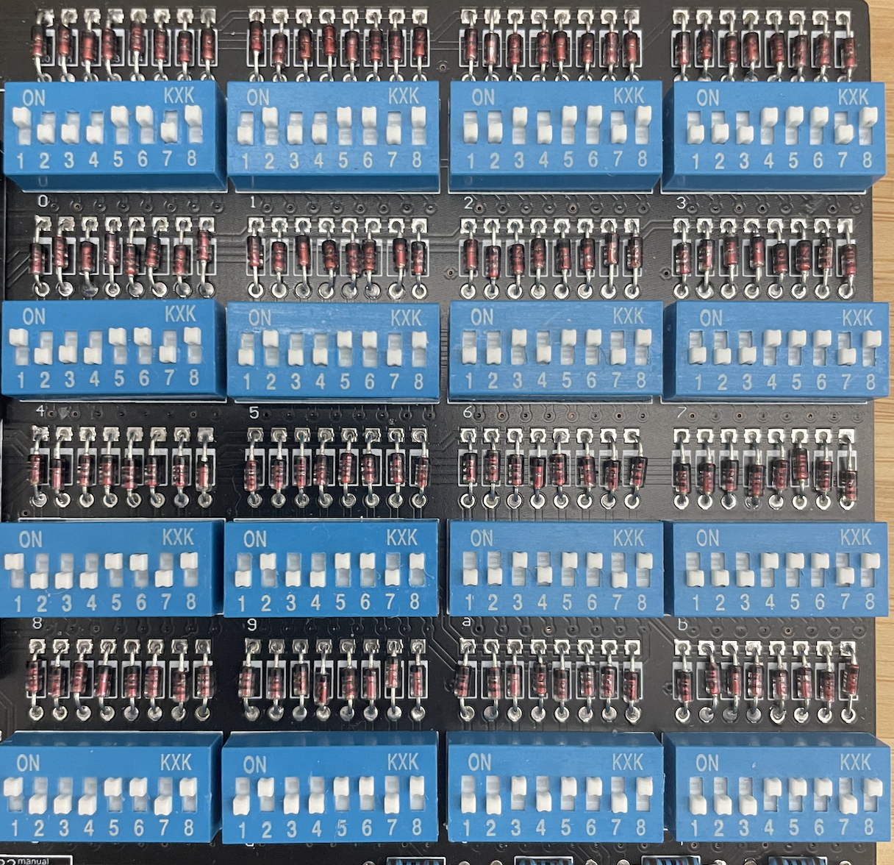</img>  
</div>
<br>

相当于循环输出1,2,4,8  `OUT Im`指令对应`1011`， `OUT 0x1`对应的指令就是`1011 0001`  

> 输出高电平，二极管就被点亮。二极管的的b0~b3对应拨码开关的bit0~bit3,也就是拨码开关序号的1~4  


## CPU焊接  
### USB 
<div align=center>
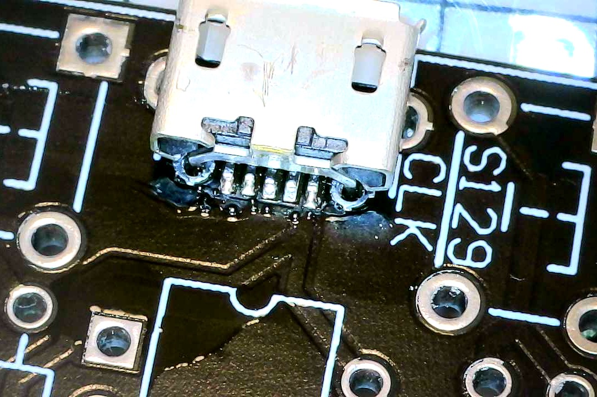</img>  
</div>
<br>

<div align=center>
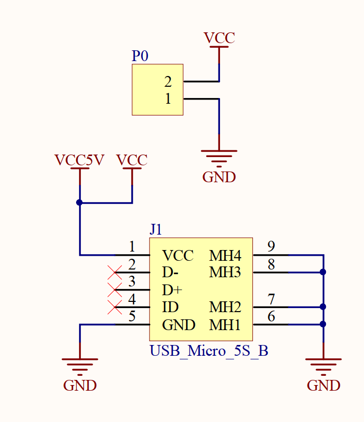</img>  
</div>

### 正面图  
<div align=center>
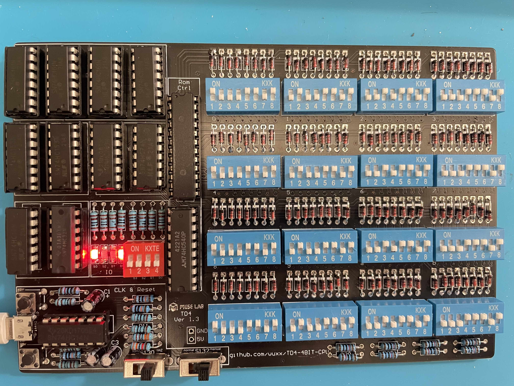</img>  
</div>

### 背面图    
<div align=center>
</img>  
</div>

## CPU编写程序
[Verilog HDL学习](https://www.bilibili.com/video/BV12y4y1v7V3?p=1)  
### [CPU Verilog代码](https://github.com/ymm135/AZPRcpu)   


## CPU展示  


## 疑问及问题

### 有一个LED(b3)一直常量 ?  

`U4`的`Q3`脚一直处于高电平，更换其他的161封装时，问题依旧存在，说明不是封装问题。那就需要沿着上游的`P3`接着找。  
首先通过调试开关把指令和数据停在(bit7~bit0)`1011 0001`，这是只有b0的LED能够被点亮，其他三个都是熄灭状态。目前自己焊接的板子还有bit0和bit3都在亮 :tired_face:  

首先测量`OUT`的`14~11`输出引脚电平情况(对应`Q0~Q3`): 高 低 低 高， 正好对应两个LED被点亮。  PE脚(9)处于低电平
再测量`OUT`的`3~6`输入引脚(对应`D0~D3`)电平情况: 低 高 低 高 ? ,那就接着查6引脚(D3)为什么是低电平，应该是高电平呀。  

查看原理图，发现`OUT` D3引脚接着 `ALU`(U9 283N)的S3引脚,先测量ALU的S1~S3引脚(对应引脚4 1 13 10)电平情况: 低 高 低 高  

那就说明是加法器输出的结果就是这样，那就看看加法器的输入参数:  
- A0~A3 对应引脚为 5 3 14 12 对应电平为: 低 低 低 低 
- B0~B3 对应引脚为 6 2 15 11 对应电平为: 低 高 低 高 

> 加法器的输出结果为:  低 高 低 高  

数据选择器HC154 `U13`的A0~A3(输入引脚23~20)为: 高 低 高 低 `1010`=>`0101`，对应的输出为: 5+1=6 (Y6),  第7位对应的拨码开关的值为`1000 1101`  
> HC154 当输入全是L是，Y0处于高电平 ，所以`0101`对应的是`Y6`  

相当于HC540 `U12`的输入参数`A1~A8`应该是`1000 1101`,实际情况是`1010 0100`
B0~B3对应的数据为D0~D3 对应HC540 `U12`  ROM控制器中， 对应的输出引脚为: 18 17 16 15 ,电平情况为: 低 高 低 高
`U12`的`2~5`输入引脚(`A1~A4)`为: 高 低 高 低    


