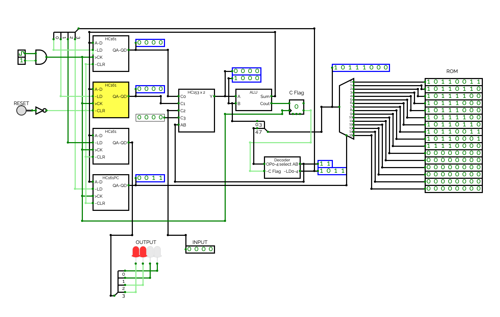

# TD4 仿真
## 地址 https://circuitverse.org/users/6130/projects/17074 

</img>

## 数字逻辑设计 
[在线学习](https://learn.circuitverse.org/)
[在线文档](https://docs.circuitverse.org/)    
[git地址](https://github.com/ymm135/CircuitVerseDocs)  
Learn Digital Logic Design easily. 
The Computer Logical Organization is basically the abstraction which is below the operating system and above the digital logic level. Now at this point, the important points are the `functional units`/`subsystems` that refer to some hardware which is made up of lower level building blocks. 

